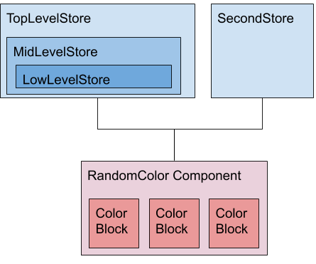
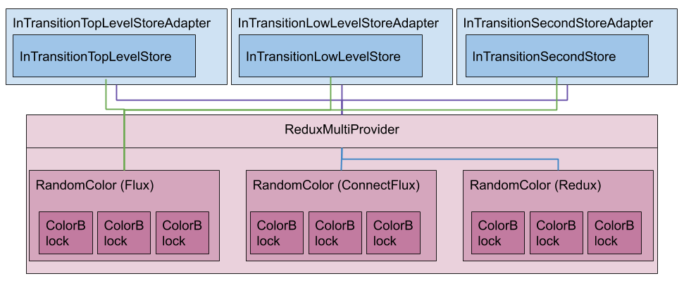

# Flux to Redux Transition Guide
> A document explaining the fundamentals of transitioning a Flux architecture to a Redux architecture.
---
* __[Goal](#goal)__
* __[Do I have to transition?](#do-i-have-to-transition-to-redux)__
* __[Influx Architecture](#influx-architecture)__
    * [Should You Use It](#should-you-implement-an-influx-architecture-during-the-transition?)
        * [Advantages](#advantages)
        * [Disadvantes](#disadvantages)
* __[Example](#example-explained)__
    * [Beginning Flux Architecture](#beginning-flux-architecture)
    * [Getting to Influx Architecture](#getting-to-influx-architecture)
        * [Influx Components](#influx-components)
        * [Influx Stores](#influx-stores)
        * [Example Specific Explanations](#example-specific-explanations)
    * [Getting to Redux Architecture](#getting-to-redux-architecture)
        * [Redux Stores](#redux-stores)
        * [Redux Components](#redux-components)

## Goal
The goal of this document is explain major elements of transitioning to Flux from Redux. This includes the introduction of an Influx architecture (which means your state management system will be... in flux), a simple and advanced transition example, and specific steps to navigate the transition.

If through this process the document / examples miss any edge cases you encounter, please create an issue or reach out so it can be added.

## Do I have to transition to Redux?
No. OverReact Redux is meant to help to provide a recommended state management method for OverReact components, as well as provide benefits over w_flux. Those benefits may provide enough reason to make a refactor wortwhile. If after evaluating the benefits / effort, the juice doesn't seem worth the squeeze then no need to worry about it!

To evaluate if the refactor is worth it, the details of OverReact Redux can be found in the [OverReact Redux doc](./over_react_redux_documentation.md). That document paired with this guide will illustrate the full scope of costs and benefits.

## Influx Architecture
### Should you implement an Influx architecture during the transition?
> tl;dr
> 
> If you assess your architecture and are confident you can go straight from Flux to Redux, you should not use Influx. If you are not confident, you should consider it.

An "Influx" architecture is simply implementing utilities that allow a library to attach Flux, Connected Flux, and Connected Redux components to the exact same store instances. The result is that those components, regardless of what state management method they use internally, can see store updates and trigger actions on that store. Consequently, new components can be written using Redux patterns and Flux components can be slowly converted.

The Influx architecture is not a required part of the process, and may make your life more difficult by adding extra steps. There are both advantaces and disadvantages, and assessing how large complexity of the refactor will likely provide the largest indication of whether or not it makes sense.

### Advantages
The main advantages are that
- You can split the effort into very tangible subtasks. The first is refactoring the state archiecture (with a light component refactor), then each component can be its own task done over time. This is more notable in libaries that have components that will be challenging to update to `Component2`. Since `connected` components need to be `Component2`, the Redux refactor may be blocked by those efforts. This option allows to update the state to a Redux friendly architecture, and then as you update components you can update them to `Component2` and `connect` at the same time.
- The workflow is much less complex. While heavily piggy backed off the first advantage, it's worth noting the workflow benefits of the incremental update. There shouldn't be as many massive merges or code reviews, and the granularity of tasks should make it more clear where manual testing is needed and when tests need to be written / updated. Ultimately this reduces the project complexity and the risk of regressions.
- The actual update process can be easier to reason about in complex scenarios. Influx merges Flux and Redux to provide a "halfway" point that is a fairly straightforward transition both from Flux and to Redux. For those complex scenarios, it may seem daunting to transition straight to Redux, and Influx can lower the barrier. 

### Disadvantages
The biggest disadvantages are that it
- Takes extra time as there are ultimately two refactors instead of one (however minimal the second one will be). While ideally the second refactor (from Influx to Redux) should be an easy lift, it's still ultimately unnecessary.
- Does not provide any performance gains. The Redux `connected` components will update on every store update as long as Flux is in the mix. This mimics the behavior of Flux, but takes away the largest benefit of connecting to Redux.
- Can add increased complexity and code to a possibly already complex state architecture. There is additional boilerplate and utilities necessary to maintain an Influx architecture that are completely unnecessary to Redux, making Influx more verbose and a little more confusing.

In summary, it never makes sense to add steps and refactoring if you can afford not to. The primary advantage in Influx is that you can break up the project. If that may become important or is enticing, it is an option!

## Example Explained
This section goes over the example in `/web/flux_to_redux/advanced/` and includes the goal of each phase and the steps to go from the last phase (starting with Flux) to the current phase.

### Beginning Flux Architecture
- Stores: The store architecture is comprised of two top level store classes (`TopLevelStore` and `SecondStore`). Within `TopLevelStore` there are two nested stores: `MidLevelStore` and `LowLevelStore`, with `LowLevelStore` being nested within `MidLevelStore`. Naturally in the real world each store architecture would be different, but for the sake of simplicity (and keeping the focus on the big picture), each store is essentially the same.

- Components: The only component rendered in the beginning is a Flux component. Each block in the UI has a background color derived from a different store, and there are a set of buttons to change each block background color.

### Getting to Influx Architecture
> If your library is simple enough that you do not intend to have an Influx architecture, this entire section can be skipped.

#### Influx Stores: 
In transition, the goal is to remove nesting from stores. Rather than having three stores nested one within another, they can be combined (flattened) or broken out into their own store. Additionally, they need to be wrapped by a class that can handle both Redux and Flux. General suggested steps to this phase are:

1. Identify the parts of the system that will be part of the initial update. The simplest approach may be to go through the compenents and understand which stores they pull from, and then look at those stores and understand how they're tied together. Or, inversely, consider which stores are most logical to update and look at the components they touch. Either way, the goal is to isolate part of the architecture to start with and frame the remaining steps through that lense. If after this step it seems like updating everything all at once makes more sense, the Influx architecture can be skipped.
1. Refactor stores to be shallow (a store cannot have a nested store within it). This can be done by either creating new stores or lifting the state up to the top level. Note that combining stores is ideal, as it moves closer to the final Redux impementaiton. This will also require a light component refactor to accept the necessary stores and change the state pointers where the locations have changed.
1. Wrap every Flux store in a `FluxToReduxAdapterStore`. 
1. Create a context object for every store instance (not necessary if you only have one store at this point).

Those are the steps necessary to get your library ready for `ConnectFlux`, and the remaining steps in this section build on these to add Redux as well. However, they can be done at a different time and you can begin refactoring components away from pure Flux at this point. To continue to implementing Redux, the remaining steps are:

5. Make state fields, those required by Redux, mutatable to functions outside the store. In other words, remove the getter to allow the actual state variable to be setable. This goes against the Flux best practice, but is important for the Influx implementation to allow Redux to update the Flux store.
1. Create a Redux action for every Flux action that needs to be mirrored by Redux. These actions can be empty classes, or all be the same class and have different `type` properties, or whatever seems most elegant when being used with a `reducer`. 
1. Create a `reducer` for every store that will be accessed by Redux and uses the actions created in the previous step. This reducer should always return the `oldState`. Rather than returning a new state like Redux instructs, the `reducer` is going to mutate the corresponding Flux store and trigger an update. Pass that reducer into the `FluxToReduxAdapterStore` constructor used in step 3.
    
These steps conclude the general refactor on the state / store side of the library.

#### Influx Components 
After updating the store as described above, if you stopped at step 4 you can update to components to `ConnectFlux` components. If you completed all 7 steps, you will want to update to Redux components.

1. Wrap your component tree in a `ReduxProvider` or `ReduxMultiProvider`. If you only have a single store to pass down to the components, a `ReduxProvider` will do. If you have multiple stores, use a `ReduxMultiProvider` to makes things more concise.
1. Refactor your (soon to be) connected components to regular `UiComponent2`.
1. Add prop fields that match those that were originally being accessed directly on the store or actions class (if you plan to use `mapDispatchToProps`).
1. Switch out `props.store` and `props.actions` calls to match the new props fields.
1. Create a `Connected[ComponentNameGoesHere]` that wraps the component factory in a `connectFlux` or `connect` call. Note that if this component still receives multiple stores, it will be helpful to wrap the factory in a `ComposeHocs` call. 
    - In the case there are multiple stores, you'll also need to utilize the context instances created in the store file and used with `ReduxMultiProvider`. You do this by utilizing the `context` parameter on `connect` / `connectFlux`. 
    - This is also where you would connect `mapStateToProps` and `mapActionsToProps` / `mapDispatchToProps`. `map(Actions/Dipsatch)ToProps` is not necessary, but can be more declarative and match the Flux convention of triggering actions via props more closely.

#### Example Specific Explanations
- All of the variables had `InTranstion` appended as the root of the variable name to differentiate them from the beginning phase variables.
- The store architecture was updated to get rid of `MidLevelStore` and combine its fields with `TopLevelStore`. Then `LowLevelStore` was broken out as its own top level store. This could have been compined with `TopLevelStore` as well, but it was done differently to show a different approach.
- Added reducers, adapters, and context.
- Wrapped components being rendered in a `ReduxMultiProvider`, adding the respective contexts and stores (adapted stores).
- Refactored `RandomColorComponent` to be both a Flux and Redux connected component.

### Getting to Redux Architecture
> Reminder that examples of reducers, stores, and actions can all be found in the over_react_redux example.

#### Redux Stores
This phase is about combining the stores possible and creating reducers that return a new state, rather than mutating existing state. You may be coming from either a pure Flux implementation or an Influx implementation. The general steps for updating each respective scenario are as follows:
- Influx: 
    1. Aggregate your flattened stores into one** state class if it isn't already. 
    1. Combine reducers into one reducer that covers all of the necessary actions for the new store.
    1. Create a store object and remove all adapters, contexts, and Flux stores.
- Pure Flux
    1. Refactor all of your Flux stores into a single** state class. This will likely be a combination of lifting state from nested stores and merging other stores together. 
    1. Create an action for every Flux action. 
    1. Create reducers that handle the actions and return a new instance of the state class.
    1. Create a new Redux store object and remove all Flux stores.

> ** The Redux best practice is to have a single store object. It's worth going to great lengths to make that work because of how easy it makes manageming library state. However, multiple stores can be kept if necessary. See the [OverReact Redux documentation](./over_react_redux_documentation.md) and the component section below for more information.

#### Redux Components
All components taking state from the store should be refactored into `Connected` components. 
- Coming from Influx, the only refactoring to do is:
    1. to change the expected state type attached to `connect` from the adapted Flux store to the new state class.
    1. Change `mapActionsToProps` to `mapDispatchToProps` and add the `dispatch` calls.
- Coming from Flux:
    1. Wrap your component tree in a `ReduxProvider` or `ReduxMultiProvider`. If you only have a single store to pass down to the components, a `ReduxProvider` will do. If you have multiple stores, use a `ReduxMultiProvider` to makes things more concise.
    1. Refactor your (soon to be) connected components to regular `UiComponent2`.
    1. Add prop fields that match those that were originally being accessed directly on the store or actions class (if you plan to use `mapDispatchToProps`).
    1. Switch out `props.store` and `props.actions` calls to match the new props fields.
    1. Create a `Connected[ComponentNameGoesHere]` that wraps the component factory in a `connectFlux` or `connect` call. Note that if this component still receives multiple stores, it will be helpful to wrap the factory in a `ComposeHocs` call. 
    - In the case there are multiple stores, you'll also need to utilize the context instances created in the store file and used with `ReduxMultiProvider`. You do this by utilizing the `context` parameter on `connect` / `connectFlux`. 
    - This is also where you would connect `mapStateToProps` and `mapActionsToProps` / `mapDispatchToProps`. `map(Actions/Dipsatch)ToProps` is not necessary, but can be more declarative and match the Flux convention of triggering actions via props more closely.

