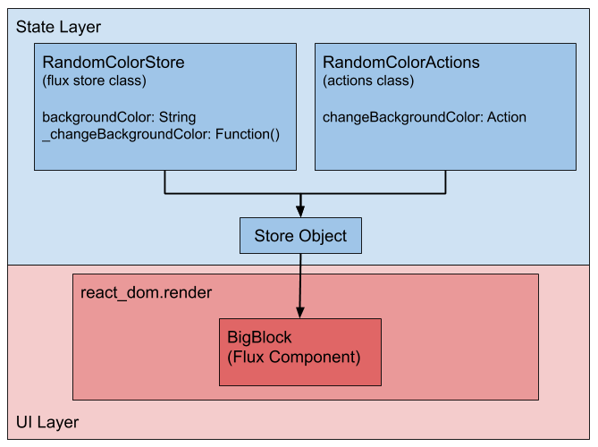
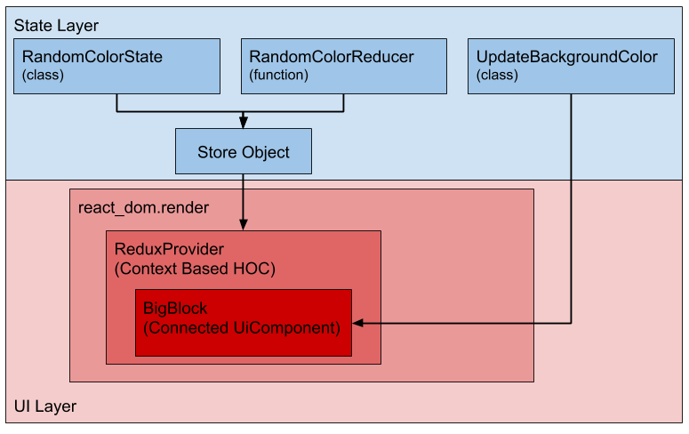
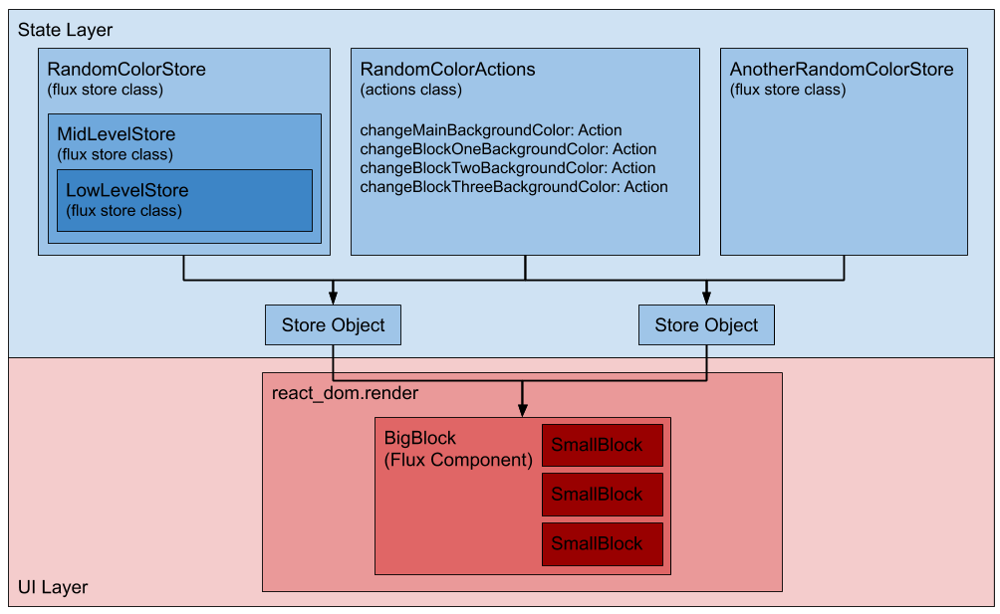
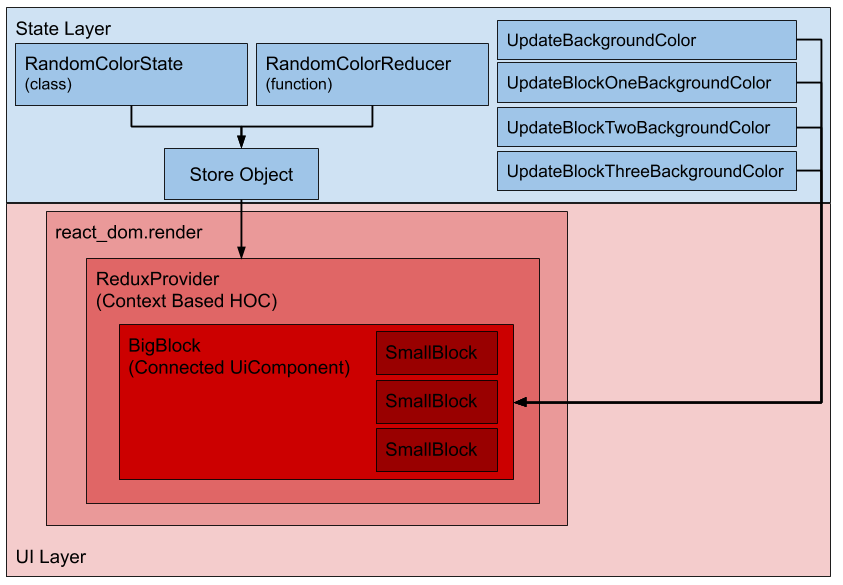

# Flux to Redux Transition Guide
> A document explaining the fundamentals of transitioning a Flux architecture to a Redux architecture.
>
> NOTE: Before attempting to transition, make sure you understand the content from the [OverReact Redux Documentation](./over_react_redux_documentation.md). This guide covers differences between Flux to Redux but does not try to comprehensively describe Redux.
---
* __[Goal](#goal)__
* __[Do I have to transition?](#do-i-have-to-transition-to-redux)__
* __[A Simple Example](#a-simple-example)__
    * [A Basic Flux App](#a-basic-flux-app)
    * [The Redux Version](#the-redux-version)
    * [Basic Example: The Main Differences](#basic-example:-the-main-differences)
    * [Basic Conversion Step by Step](#basic-conversion-step-by-step)
* __[An Advanced Example](#an-advanced-example)__
    * [An Advanced Flux App](#an-advanced-flux-app)
    * [Converted to Redux](#converted-to-redux)
    * [Advanced Conversion Step by Step](#advanced-conversion-step-by-step)
    * [What if the Advanced Conversion is too Daunting?](#what-if-the-advanced-conversion-is-too-daunting?)
* __[Influx Architecture](#influx-architecture)__
    * [What is Influx?](#what-is-influx?)
    * [Should You Use It](#should-you-implement-an-influx-architecture-during-the-transition?)
        * [Advantages](#advantages)
        * [Disadvantes](#disadvantages)
    * [Important Terms](#important-terms)
    * [Steps to an Influx Refactor](#steps-to-an-influx-refactor)

## Goal
The goal of this document is explain major elements of transitioning from Flux to Redux. This includes explanation of both a simple and more advanced conversion, and the introduction of a new architecture as a last resort for the most extreme cases.

If, through this process, the document or examples miss any edge cases you encounter, please create an issue or reach out so it can be added.

## Do I have to transition to Redux?
No. OverReact Redux is meant to help to provide a recommended state management method for OverReact components, as well as provide benefits over w_flux and built_redux. Those benefits may provide enough reason to make a refactor worthwhile. If, after evaluating the benefits and effort, the juice doesn't seem worth the squeeze, then no need to worry about it!

To evaluate if the refactor is worth it, the details of OverReact Redux can be found in the [OverReact Redux doc](./over_react_redux_documentation.md). That document paired with this guide will illustrate the full scope of costs and benefits.

## A Simple Example
To illustrate the basic changes that will occur, this section will go through a basic Flux architecture and then show
 that same system with Redux instead. This section will also have a step by step list of instructions for an update 
 as straight forward as this one. An actual working example can be found in the [Flux to Redux Example](.
 ./web/flux_to_redux/simple/readme.me).

> NOTE: This section does not cover the complexities of having multiple stores, which presents more challenges than a single store. For a more complex example [see the advanced example below](#an-advanced-example).

### A Basic Flux App
For our example, here are our different items of interest:
- __The Flux Store Class:__ we have a Flux store called `RandomColorStore` that is responsible for diplaying a random background color. The only state field is `backgroundColor`. `RandomColorStore` also has a `_changeBackgroundColor` function, and when called it sets `backgroundColor` to a new random color. 
- __The Actions Class:__ There is an Actions class that has a single action: `RandomColorActions`. It only holds one action (`changeBackgroundColor`), which triggers `_changeBackgroundColor` in the store. 
- __The Action Object:__ we create an object `randomColorActions` that is an intantiated instance of `RandomColorActions`.
- __The Store Object:__ Our store, called `randomColorStore`, is instantiated with `randomColorActions` being passed in.
- __The UI:__ The only component is a `BigBlock` component that receives `randomColorActions` and `randomColorStore` as props. Updates are triggered by calling `actions.changeBackgroundColor` and state is accessed by using `props.store.state`. The actual UI itself is just the component, with its background color set to the state background color, and a button that triggers the action to update the state background color.



### The Redux Version
For our example, here are our different items of interest:
- __The State Class:__ we have a class (`RandomColorState`) that has `backgroundColor` property. It also has a couple different constructors that make instantiation in different contexts easier, like for the default state and when updating the state.
- __Actions:__ we have a single action class called `UpdateBackgroundColorAction`. It has no content because all we need is the the `type` and an action (though actions can be implemented in a handful of ways).
- __The Reducer:__ our reducer simply looks for an action of type `UpdateBackgroundColorAction`, and when it finds it, the reducer returns a new instance of `RandomColorState` with a new background color.
- __The Store Object:__ we create a store object called `randomColorStore`, instantiating it with our reducer and the default state of `RandomColorState`.
- __The UI:__ All of our UI componentry is wrapped in a `ReduxProvider`. The provider takes in a `store` prop, to which we pass `randomColorStore`. The only component is a `BigBlock` connected component. Updates are triggered by calling `props.dispatch(UpdateBackgroundColorAction())`, and since it's a connected component (using `mapStateToProps`) state is accessed via normal props usage.



### Basic Example: The Main Differences
- __We replace the Flux store with both a state class and a reducer.__ In Redux, we do not define a class that is responsible for handling state updates. Rather, we create the model and a function to describe updates and use them in the instantiation of a Redux `Store` object.
- __Actions are not held in an overarching wrapper class.__ Typically in Redux, actions "stand alone" from each other. Our reducer should have cases for all the actions that exist, but unlike Flux there is no need to knit our store and actions together by actually providing an actions instance. Consequently, actions are broken away, pulled directly into the component, and triggered using `dispatch`.
- __In Redux, actions and state are not passed directly as props from a parent component.__ In actuality, that statement is more nuanced and has some hidden complexity. On the surface though, Redux UI uses context and the `connect` function to associate state directly with props without needing to actively pass the store from parent to child all the way through a component tree. 

### Basic Conversion Step by Step
> NOTE: This document does not attempt to teach _how_ to use Redux. If any of these steps cause confusion on the implementation details of Redux, see the [OverReact Redux Documentation](./over_react_redux_documentation.md).
1. __Refactor the actions to stand alone.__ This should be a fairly direct 1 to 1 transition.
1. __Pull state mutation logic out of the store and into a reducer.__ Typically within a Flux store you have a `triggerOnActionV2` call that identifies an action and a function used to respond to that action. 
    ```dart
    // Before transition, within a store class called ExampleFluxStore...
        // Constructor
        ExampleFluxStore(this._actions) {
            triggerOnActionV2(_actions.changeBackgroundColor, _changeBackgroundColor);
        }

        // Function to update the _backgroundColor state field
        _changeBackgroundColor(String _) {
            _backgroundColor = '#' + (Random().nextDouble() * 16777215).floor().toRadixString(16);
        }

    // After being transitioned to a reducer..
    ExampleState reducer(ExampleState oldState, dynamic /*or an action type*/ action) {
        // Assumes an action called ChangeBackgroundColor was created in step 1
        if (action is ChangeBackgroundColor) {
            final color = '#' + (Random().nextDouble() * 16777215).floor().toRadixString(16);
            return ExampleState.update(color: color);
        }

        return oldState;
    }
    ```
1. __Create the state model.__ After pulling out state mutation logic, this should be as simple as renaming the class, not inheriting from the Flux store class, and cleaning up anything unrelated to the actual state fields. 
1. __Instantiate the store class, using the state model and reducer.__
1. __Add a `ReduxProvider` around the component tree.__ This will take in the store instantiated in step 4 as the component's `store` prop.
1. __Refactor componentry to not longer be a `FluxUiComponent` and instead be a connected `UiComponent2`.__ In terms of moving away from Flux, the simplest case is that props and prop calls need to be updated. Props will need to be added to make room for the ones consumed by the Redux component, and any `props.actions` calls need to be updated to `props.dispatch` (unless you're using `mapDispatchToProps`). 

## An Advanced Example
In the case a Flux app has a complex store architecture that involves multiple stores, whether they by nested under 
one store or be completely separate, the transition process has a few additional catches. This section goes over 
transitioning from an architecture with multiple stores, and the example code can be found in the [Advanced Example](
../web/flux_to_redux/advanced/readme.md).

This section builds on the [simple example](#a-simple-example), so ensure that section makes sense conceptually before looking at multiple stores.

### An Adanced Flux App
For this app, here are the different elements:
- __The Flux Store Classes:__ we have a Flux store called `RandomColorStore` that is responsible for diplaying a random background color. Unlike the simple example, this store has a few different levels. Within `RandomColorStore`, there's another store called `midLevelStore` (typed as the class `MidLevelStore`). The `MidLevelStore` class has a field called `lowLevelStore` (typed as the class `LowLevelStore`). So `RandomColorStore` is three different stores. Additionally, there is another store class called `AnotherRandomColorStore`. This class is entirely separate from `RandomColorStore`. 

    Despite there being four stores, all of them have the same job: handle a single random color property. Therefore, they are all nearly identical objects. Naturally in the real world they would likely be drastically different, but for simplicity sake and keeping the focus on the big picture they are all left the same.

- __The Actions Class:__ the action class (`RandomColorActions`) has a different action to trigger a background color update in every store. Consequently, there are four actions.
- __The Action Object:__ we create an object `randomColorActions` that is an intantiated instance of `RandomColorActions`.
- __The Store Objects:__ We'll instantiate two store objects: `bigStore` and `littleStore`. `bigStore` will be an instance of `RandomColorStore` and `littleStore` will be of `AnotherRandomColorStore`. Both objects take in the same instance of `randomColorActions`.
- __The UI:__ The only component is a `BigBlock` component that receives `randomColorActions`, `bigStore`, and `littleStore` as props. Updates are triggered by using the action prop. Naturally now state is accessed via:
    - props.bigStore.state
    - props.bigStore.midLevelStore.state
    - props.bigStore.midLevelStore.lowLevelStore.state
    - props.littleStore.state

    Our `BigBlock` component renders three `SmallBlock` components. Each one connects to a different store's state, with the remaining background color being tied to `BigBlock` itself. `BigBlock` also has four buttons - one connected to each action that changes the background color property of one of the stores (and thereby updating the component background color).

    A Flux specific part of the `BigBlock` component is that we need to set the `redrawOne` to listen to the story at every level.



### Converted to Redux
The Redux app doesn't really have any surprises, and at a high level is very similar to the simple example:
- __The State Class:__ we have a class (`RandomColorState`) that has four properties: 
    - mainBackgroundColor
    - blockOneBackgroundColor
    - blockTwoBackgroundColor
    - blockThreeBackgroundColor
- __Actions:__ we have four actions as their own classes; one class for each state class property.
- __The Reducer:__ as probably expected, our reducer is also similar to the simple app but with a condition for each action. This reducer is especially contrived because the simplicity of the store data makes each case the same with the only difference being the property the update is pointed at.
- __The Store Object:__ same as the simple example.
- __The UI:__ like the simple example, our component tree is wrapped in a `ReduxProvider`. Otherwise the component architecture is the same as the Flux version, minus the Flux-y parts. We have a connected `UiComponent2` called `BigBlock` that maps the store state to props, which passes the props to its three `SmallBlock`s, with four buttons to trigger the background actions. Naturally all the Flux parts were removed, including the `redrawOn` override.



### How is the transition process different with more stores?
__You should only have one Redux store.__ If that doesn't sound scary, you're in good shape and everything is great! Some libraries won't have an issue with that, and in that case it's as simple as following the steps in the next section.

If having one store sounds unfeasible or raises a lot of concerns, there's more to talk about. The authors of Redux have said multiple times ([1](https://redux.js.org/api/store#a-note-for-flux-users), [2](https://stackoverflow.com/questions/33619775/redux-multiple-stores-why-not)) that more than one store is not needed, and the exceptions are related to performance and not architecture. The concession is that there are supported ways to have multiple stores, but those are to be used as a last resort and should not be part of an initial refactor attempt.

This leads to the difference in the transition process. Not only do the stores have to come together, but componentry needs to reflect that the data is coming from a single source. 

### Advanced Conversion Step by Step
> These steps are just a set that make sense for general situations and may not make sense for every library. If the path forward is unclear, they can be referred to for guidance but may need adjustment or supplemental steps.
1. __Diagram store and component relationships.__ While perhaps challening and time consuming, creating a diagram that illustrates generally which components care about which stores could prove invaluable to planning the update process.
1. __Break the refactor into groups that includes the stateful layer and the UI layer.__ Are there small chunks of the system that can be updated without touching the messiest knots in the system? If so, identify them. If this step seems particularly challenging or reveals large roadblocks, consider an [Influx architecture](#influx-architecture)
1. __Refactor all the stores and reducers in that group into one.__ By doing the stores and reducer at the same time, you can completely invalidate a single store at a time. If you have already created a state class and a reducer for an earlier store group, continue adding to the same reducer and state class. Worth noting is that these app examples use a very simplistic reducer approach, and understanding the options with reducers may be worthwhile. Because there are multiple ways to implement reducers, it is likely one will make more sense than others.
1. __Create any new action classes that are necessary.__
1. __Refactor components into connected components.__ Update the component to `UiComponent2`, removing all Flux boilerplate, and wrapping the already declared factory with the `connect` call.
1. __Move on to the next group.__ If the refactor has multiple groups of stores and components, move on to the next one.
1. __Add a `ReduxProvider` around the component tree.__ Once it makes sense, wrap the tree in the `ReduxProvider` component.

### What if the Advanced Conversion is too Daunting?
The advanced conversion might sound like a huge initiative with numerous unknowns and complexities. If that's the case the first question is whether Redux will offer the benefits to justify a large initiative. Our [OverReact Redux documentation](./over_react_redux_documentation.md) includes some of the benefits, and there are many [articles online](https://www.google.com/search?q=the+benefits+of+redux&oq=the+benefits+of+redux) that provide more examples. 

If Redux makes sense but the conversion project seems extremely challenging, we have a middleground: introducing __Influx__.

## Influx Architecture
### What is Influx?
Influx is just the term we're giving to an architecture that is both Redux and Flux at the same time. To aide in the transition from Flux to Redux, tools have been built to allow Flux and Connected (Redux) components to all talk to the same store. It's a transitional architecture that allows the library to be non-commital to the state management system, ultimately letting the transition from Flux to Redux to be a much more incremental process.

### Should you implement an Influx architecture during the transition?
> tl;dr
> 
> If you assess your architecture and are confident you can go straight from Flux to Redux, you should not use Influx. If you are not confident, you should consider it.

The Influx architecture is not a required part of the process, and may make your life more difficult by adding extra steps. There are both advantages and disadvantages, and assessing how large the refactor will likely provide the largest indication of whether or not it makes sense.

### Advantages
The main advantages are that:
- __You can split the effort into very tangible subtasks.__ The first is refactoring the state architecture (with a light component refactor), then each component can be its own task done over time. 
- __Inability to update entirely to `Component2` is not a blocker.__ Since `connected` components need to be `Component2`, the Redux refactor may be blocked by those efforts. This option allows the library to update the state system to a Redux friendly architecture while updating components to `UiComponent2` and `connect` at the same time.
- __The workflow is much less complex.__ While heavily piggy backed off the two advantages, it's worth noting the workflow benefits of the incremental update. There shouldn't be as many massive merges or code reviews, and the granularity of tasks should make it more clear where manual testing is needed and when tests need to be written or updated. Ultimately this reduces the project complexity and the risk of regressions.
- __The actual update process can be easier to reason about in complex scenarios.__ Influx merges Flux and Redux to provide a "halfway" point that is a fairly straightforward transition both from Flux and to Redux. For those complex scenarios, it may seem daunting to transition straight to Redux, and Influx can lower the barrier. 

### Disadvantages
The biggest disadvantages are that it:
- __Takes extra time as there are ultimately two refactors instead of one (however minimal the second one will be).__ While ideally the second refactor (from Influx to Redux) should be an easy lift, it's still ultimately unnecessary.
- __Does not provide any performance gains until the transition is complete.__ The Redux `connected` components will update on every store update as long as Flux is in the mix. This mimics the behavior of Flux, but takes away the largest benefit of connecting to Redux.
- __Can add increased complexity and code to a possibly already complex state architecture.__ There is additional boilerplate and utilities necessary to maintain an Influx architecture that are completely unnecessary to Redux, making Influx more verbose and a little more confusing.

In summary, it never makes sense to add steps and refactoring if you can afford not to. The primary advantage in Influx is that you can break up the project. If that may become important or is enticing, it is an option!

### Important Terms
If this architecture is appealing, there are a few new classes and utilities it will be beneficial to be aware of.
- __`connectedFlux`:__ This is a function that operates the same way as `connect` does for Redux components, but it connects a Flux component. This is useful because it is one step closer to a Redux connected component without being Redux. If, for any reason, implementing the Redux side of Influx is presenting challenges, `connectFlux` provides a good middle ground.
- __`FluxToReduxAdapterStore`:__ This is a class that wraps Flux store and makes it look like a Redux store. It is the cornerstone of Influx because pure Flux components will stay connected to the original store instance, but Redux components and connected Flux components (using `connectFlux`) will connect to the instatiated `FluxToReduxAdapaterStore` object. This works by passing in a Flux store instance, a Flux actions instance, and a modified Redux reducer function.
- __`composeHocs`:__ This is a function that groups `connect` or `connectFlux` calls. If a component takes in multiple stores, it needs to be connected to all of them. Without this utility, this could still be done but introduces unfortunate formatting that is more difficult to reason about. This optional utility makes those cases easier to read and modify.
- __`ReduxMultiProvider`:__ This Component has a similar purpose as that of `composeHocs`, but for a `ReduxProvider` instead. If the component tree does have multiple stores, the norm is to have multiple nested `ReduxProvider` instances with different context properties. Similar to multiple nested `connect` calls, this is not ideal. This optional component has the prop `storesByContext` that takes in a map of contexts (key) and `FluxToReduxAdapterStore` instances (value).

### Steps to an Influx Refactor
Influx has two steps to the refactor. The first is to go from Flux to Influx. This part of the process can take as long as it needs to and is meant to be an incremental transition. The next step is to go from Influx to Redux, which should be a swift refactor of stores with a light UI refactor.

#### Flux to Influx

1. __Diagram store and component relationships.__ Similar to the Advanced conversion, it still makes sense to understand the current state of the architecture and determine where to place stores that will be in the Influx state.
1. __Break the refactor into groups that includes the stateful layer and the UI layer.__ Similarly, this will be like Advanced conversion. The difference is that in Influx, this phase will allow for teams to identify where the blockers are and which components will remain Flux, be converted to Connected Flux, or receive the full update to Redux.
1. __Refactor relevant stores to be flat.__ For Influx, the idea that you can still have as many stores as you need. However, they must not have nested stores inside. Any nested stores should have their state lifted to the highest level or be broken into their own instance.
1. __Make relevant Flux store state fields publicly accessible.__ Normally Flux store values are not meant to be mutated directly. This is still fine for an Influx implementation _unless a Redux component needs access_. In other words, if a Redux component can trigger an action that should update that store value, it needs to have a public setter.
1. __Add adapter stores where necessary.__ Each store that will be Influx should be wrapped with a `FluxToReduxAdapterStore` to give Redux and Connected Flux access as well. `FluxToReduxAdapterStore` takes in a Flux store, an actions instance, and optionally a reducer. If this store will only need to talk to Connected Flux, a reducer is not needed. Also, if the Redux component only _receives_ updates and doesn't need to trigger actions, a reducer is not needed.

    If you _do_ need a reducer, there is a special way to write an Influx reducer. Below is a comparison between a normal, basic Redux reducer and an Influx reducer:

    ```dart
    // Normal Redux reducer
    StateModel reducer(StateModel oldState, dynamic action) {
        if (action is SpecificAction) {
            return oldState.update(newValue: 'Hi there');
        }

        return oldState;
    }

    // Influx Reducer
    // [1]: Rather than using a Redux state class, the return value is the normal (not adapted) Flux Store.
    // [2]: Rather than updating the state model like one would in Redux, a Flux store is mutated directly.
    // [3]: Because the Flux store was mutated without triggering the actual Flux action, the store needs to have an update triggered.
    // [4]: Always return the old state.

    /*[1]*/  FluxStore reducer (FluxStore oldState, dynamic action) {
        if (action is SpecificAction) {
            /*[2]*/ fluxStore.newValue = 'Hi there';
            /*[3]*/ fluxStore.trigger();
        }

        /*[4]*/ return oldState;
    }
    ```
1. __Create `Context` instances for the necessary stores.__ If a component will use multiple stores, a `Context` instance is required. The [OverReact Redux docs](./over_react_redux_documentation.md) have examples of having multiple stores, which describes the fundamentals of why this is necessary. In the end, it is most likely that the majority of `FluxToReduxAdapterStore` instances will need a `Context` instance. 
1. __Wrap the component tree in a either a `ReduxProvider` or a `ReduxMultiProvider`.__ If there are multiple stores, a `ReduxMultiProvider` is more elegant and is encouraged. The store instances passed in should be the `FluxToReduxAdapterStore` instances, not the normal Flux store instances.
1. __Refactor components.__ See the specific component type below for a reminder on which store instance is correct, and any "gotchas" in the refactor. In general, remember that if a component talks to multiple stores, `composeHocs` can be used to simplify the connected factory declarations.
    - __A Flux component__ will operate exactly the same way. 
        - Pass in the normal Flux store instance as a prop. Not the `FluxToReduxAdapterStore` instance, but _the same Flux store instance_ used to istantiate the `FluxToReduxAdapterStore` object. 
        - The actions prop should also be _the same action class instance_ passed into the `FluxToReduxAdapterStore` constructor. 
    - __A Redux component__ will use the `connect` function. 
        - The `pure` parameter on `connect` should be set to `false`, or else it will not receive regular updates. 
        - If the component tree was wrapped in a `ReduxMultiProvider`, the `context` parameter should also be set to the relevant store context.
    - __A Connected Flux component__ is essentially the same as a Redux component.
        - The only exception is thate `mapDispatchToProps` (Redux `connect` parameter) is `mapActionsToProps` for a Connected Flux component.
1. __Continue this process of refactoring stores and components__ until most components are Redux components.

#### Influx to Redux
Woohoo! The library is now Influx! That transition can take as long as it needs to. The next steps are to go from Influx to Redux:

1. __Create a library state class__ (that can be just an empty class declaration right now).
1. __Choose a Reducer strategy__ for the final Redux implementation, and be aware of how you will transfer Flux store mututation logic into that new reducer strategy. 
1. __For each Flux store:__
    1. __Pull out the state properties.__ Take the state variables out of the Flux store and aggreggate them all in the Redux state class.
    1. __Add to your reducers.__ Remove the state mutation logic and start to add to or build your respective reducers.
    1. __Create the Redux actions for that store.__
    1. __Create the Redux store object.__ This only needs to be done once, so after the first store is done this step can be skipped.
    1. __Update the UI side of things.__ Instead of your `ReduxProvider` pointing to the `FluxToReduxAdapterStore`, point it to the new Redux store instance. Connected Flux components will need to be updated to just Connected Redux components, but otherwise the componetry should not need to be updated.
    1. __Remove the `FluxToReduxAdapterStore` instance and the context instance.__
    1. __Keep going!__

