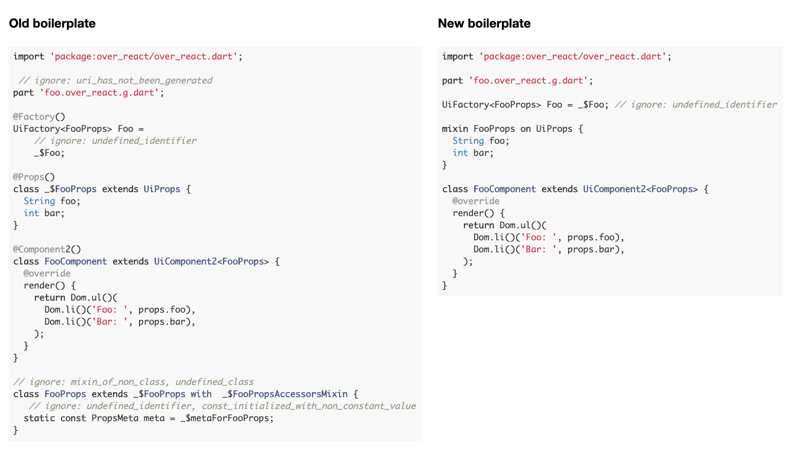

# New OverReact Boilerplate Migration Guide

_Preview of new boilerplate:_


* __[Background](#background)__
    * [Problems with Previous Boilerplate](#problems-with-previous-boilerplate)
* __[New Boilerplate Updates](#new-boilerplate-updates)__
    * [Design Constraints](#design-constraints)
    * [Updates](#updates)
        * [Add `castUiFactory` Utility](#add-castuifactory-utility)
        * [Remove Annotations](#remove-annotations)
        * [Ignore Ungenerated Warnings Project-Wide](#ignore-ungenerated-warnings-project-wide)
        * [Use Mixin-Based Props Declaration that Disallows Subclassing](#use-mixin-based-props-declaration-that-disallows-subclassing)
        * [Consume props from all props mixins by default](#consume-props-from-all-props-mixins-by-default)
    * [Examples](#examples)
* __[Function Component Boilerplate](#function-component-boilerplate)__
    * [Constraints](#function-component-constraints)
    * [Syntax](#syntax)
* __[Upgrading Existing Code](#upgrading-existing-code)__

## Background

While converting the boilerplate for OverReact component declaration from Dart 1 
transformers to Dart 2 builders, we encountered several constraints that made us 
choose between dropping backwards compatibility (mainly support for props class 
inheritance), and a less-than-optimal boilerplate.

To make the Dart 2 transition as smooth as possible, we chose to keep the new 
boilerplate version as backwards-compatible as possible, while compromising the 
cleanliness of the boilerplate. In time, we found that this wasn't great from a 
user experience or from a tooling perspective.

Knowing this, and having dropped support for Dart 1, we now have the opportunity 
to implement an improved version of OverReact boilerplate that fixes issues 
introduced in the latest version, as well as other miscellaneous ones.

### Problems with Previous Boilerplate

#### Public API and Code Generation

The current, Dart-2-only boilerplate generates public props classes:

```dart
// User-authored
@Props()
class _$FooProps extends BarProps {
  String foo;
}

// Generated in .over_react.g.dart
class FooProps extends _$FooProps with _$FooPropsAccessorsMixin {
  
  static const PropsMeta meta = ...;
  ...

}
```

In using the build packages's `build_to: cache` to generate public APIs, command-line 
tools like `dartanalyzer` and `dartdoc` don't function properly for packages that do this. 

This pattern can also degrade the dev experience, by requiring a build before code is 
statically valid, and also requiring rebuilds in some cases to consume public API 
updates during their development (e.g., writing new component props classes).

The transitional _(backwards-compatible with Dart 1)_ boilerplate, currently used in 
almost all repos, does not have these issues, as it requires users to stub in these 
public classes:

```dart
// User-authored
@Props()
class _$FooProps extends BarProps {
  String foo;
}

// Also user-authored
class FooProps
    extends _$FooProps
    with
        // ignore: mixin_of_non_class, undefined_class
        _$FooPropsAccessorsMixin {
  // ignore: const_initialized_with_non_constant_value, undefined_class, undefined_identifier 
  
  static const PropsMeta meta = _$metaForPanelTitleProps;

}
```

This is overly verbose, confusing, and error-prone. Authoring components should be 
simple and easy.

#### Inheritance

Props are declared as fields, and we generate the accessor (AKA getters/setters) 
implementations that are to be used when reading and writing props.

If the consumer authors the public-facing class, we have to do this in new 
generated subclasses to be able to override the field implementation.

```dart
// Source
class FooProps {
  int foo;
}

// Generated
mixin $FooPropsAccessors on FooProps {
  @override  int get foo => props['foo'];
  @override  set foo(int value) => props['foo'] = value;
}

// This class is actually what's used under the hood, not FooProps.
class $FooProps = FooProps with $FooPropsAccessors;
```

However, if consumers were to extend from the authored class, they wouldn't 
inherit these generated fields.

```dart
class BarProps extends FooProps {
  String bar;
}

test() {
  // references `FooProps.foo`, not the `$FooProps.foo` getter as desired.
  BarProps().foo;
}
```

## New Boilerplate Updates

### Design Constraints

#### Technical Constraints:

1. We cannot use resolved AST to generate components because it slows down 
the build too much.

    In other words, we have access to the structure of the code within a 
    given file but not its full semantic meaning, and cannot resolve 
    references it makes to code in other files.
    
    For instance, we can look at a class and see the name of the class it 
    extends from and the methods it declares, but we won't be able to know 
    where the parent class comes from, what type(s) the parent implements, 
    or which member(s) the parent declares.

2. User-authored code must reference generated code somehow to "wire it up".

    Since generated code can be output only to new files, component 
    registration / wiring of generated code requires either:
    
    1. a centralized, generated registry that maps components to generated 
    component code, and that must be generated for and consumed in that 
    main() method of all consuming apps' entrypoints.
    
    2. a user-authored entrypoint (field initializer, method invocation, 
    constructor, etc.) that imports (or pulls in via a part) and references 
    generated code (what we have now).

#### Self-Imposed Constraints:

1. Keep component declarations as terse and user-friendly as possible.

2. Use `build_to: cache` (for more information, see: 
[pkg:build docs](https://github.com/dart-lang/build/blob/master/docs/builder_author_faq.md#when-should-a-builder-build-to-cache-vs-source)).
    
    `build_to:cache` should be used when generated code is dependent on the 
    library's underlying implementation. This may not be strictly the case 
    today, but if we commit to `build_to: cache`, we will have more 
    flexibility in the future to make improvements or fix bugs to OverReact 
    code generation without requiring a (very expensive) breaking change. 
    
    It would also result in improvements to the builder being propagated 
    immediately as soon as they're consumed by wdesk, as opposed to having 
    to regenerate code and release within every consumer library.

3. Make source code statically analyzable without running a build.

    The build docs instruct not to use build_to: cache to generate public 
    APIs, and command-line tools like `dartanalyzer` and `dartdoc` don't 
    function properly for packages that do this. 
    
    Generating public APIs can also degrade the dev experience, by requiring 
    a build before code is statically valid, and also requiring rebuilds in 
    some cases to consume public API updates during their development (e.g., 
    writing new component props classes).
    
4. Provide some means of sharing props/state declarations between 
components.

    Being able to share props/state between multiple components is useful, 
    especially when composing them together. We also have many legacy 
    components that currently share props, and want to make it possible 
    to upgrade them.
    
5. Provide a simple migration path for _most_ components in our consumer 
ecosystems.

    We can support new/old boilerplate at the same time, and slowly phase 
    out the old as we migrate over to it using 
    [our `boilerplate_upgrade` codemod](#upgrading-existing-code).
    
    For cases that don't migrate cleanly within the Workiva ecosystem, 
    we can use the Wdesk versioning policy to replace them with APIs that 
    use the new boilerplate in major versions or using versioned APIs.
    
6. Only support Component2 components.

    The builder has different code paths for Component/Component2, and 
    supporting an additional boilerplate for both would increase code 
    complexity and effort needed to build/test it. 

### Updates

#### Add `castUiFactory` Utility

A utility called `castUiFactory` has been added that protects against implicit cast warnings
on factory declarations. All that needs to be done is to wrap the generated factory with
`castUiFactory`, so that it can infer the typing from the left hand side and cast the
factory (considered "dynamic") to the correct type.

```diff
@Factory()
UiFactory<FooProps> Foo =
+    castUiFactory(_$Foo); // ignore: undefined_identifier
```

#### Remove Annotations

`@Factory()`, `@Props()` and `@Component()` annotations add additional 
visual clutter to the boilerplate, and are redundant since the factory/
props/component declarations already have a consistent/restricted 
structure and naming scheme that makes it clear to the builder parsing 
logic that a component is being defined, and what each part is.

```diff
- @Factory()
UiFactory<FooProps> Foo =
    castUiFactory(_$Foo); // ignore: undefined_identifier

- @Props()
class _$FooProps extends BarProps {
  String foo;
}

- @Component2()
class FooComponent extends UiComponent2<FooProps> {
  @override
  render() => 'foo: ${props.foo}';
}
```

Annotations can still be used, opt-in, if custom configuration is needed.

```dart
@Props(keyNamespace: 'customNamespace.')
class _$FooProps extends BarProps {
  String foo;
}
```

#### Ignore Ungenerated Warnings Project-Wide

Right now, we have to add `// ignore: uri_has_not_been_generated` to each 
component library on the part/import that references generated code.

Ignoring this hint globally within analysis_options.yaml:

```yaml
 analyzer:
   errors:
     uri_has_not_been_generated: ignore 
```

Allows individual ignores to be omitted, which will reduce clutter in 
the component boilerplate.

```diff
- // ignore: uri_has_not_been_generated
part 'foo.over_react.g.dart';
```

This warning is also ignored by default in [workiva_analysis_options](https://github.com/Workiva/workiva_analysis_options).

#### Use Mixin-Based Props Declaration that Disallows Subclassing

_Constraints_:

* Props classes must directly subclass UiProps, only inheriting other props 
via mixins.

    * This requires consumers to include every single mixin within their `with` 
    clause, allowing the builder to mix in the generated code corresponding 
    to those mixins.
    
* Props can only be declared in mixins. 

    * This ensures they can be inherited by other props classes (by mixing them in, since you can no longer inherit them via subclassing) and provides consistency around how props are declared.

##### New Boilerplate (from transitional boilerplate)

```diff
- // ignore: uri_has_not_been_generated
part 'foo.over_react.g.dart';

- @Factory()
UiFactory<FooProps> Foo =
+    castUiFactory(_$Foo); // ignore: undefined_identifier

- @Props()
- class _$FooProps extends BarProps {
+ mixin FooPropsMixin on UiProps {
  String foo;
}

+ class FooProps = UiProps with FooPropsMixin, BarPropsMixin;

- @Component2()
class FooComponent extends UiComponent2<FooProps> {
  @override
  render() => 'foo: ${props.foo}';
}

- // ignore: mixin_of_non_class, undefined_class
- class FooProps extends _$FooProps with _$FooPropsAccessorsMixin {
-   // ignore: undefined_identifier, const_initialized_with_non_constant_value
-   static const PropsMeta meta = _$metaForFooProps;
- }
```

Note how props previously within `_$FooProps` were moved to `FooPropsMixin`, which is now mixed into the concrete `FooProps` class, along with another props mixi, `BarPropsMixin`.

_Generated code_:

```dart
part of 'foo.dart';

//
// (Component and factory code is pretty much the same.)
//

mixin $FooPropsMixin on FooPropsMixin {
  @override
  String get foo => props['foo'];
  @override
  set foo(String value) => props['foo'] = value;
}

class _$FooPropsImpl extends FooProps
    // These mixins are derived from the list of mixins in the source
    with $FooPropsMixin, $BarPropsMixin {}
```

##### Abbreviated Version

When no other mixins are used, you can omit the concrete props class and just use the mixin.

```dart
import 'package:over_react/over_react.dart';

part 'foo.over_react.g.dart';

UiFactory<FooProps> Foo = 
    castUiFactory(_$Foo); // ignore: undefined_identifier

mixin FooProps on UiProps {
  String foo;
}

class FooComponent extends UiComponent2<FooProps> {
  @override
  render() => 'foo: ${props.foo}';
}
```

##### Props Meta Changes

Props meta will be generated as an overridden getter on the component 
as opposed to the current static field, and will allow similar access 
of prop keys as before.

This eliminates the current `meta` portion of the boilerplate which has 
to reference more generated code.

Prop meta from all mixins can be accessed, allowing us to default 
`consumedProps` to all props statically accessible from that component.

Consumption: 

```dart
@Props()
class FooProps extends UiProps with FooPropsMixin, BarPropsMixin {}

@PropsMixin()
mixin FooPropsMixin on UiProps {
  @requiredProp
  int foo;
}

@Component2()
class FooComponent extends UiComponent2<FooProps> {
  @override
  render() => [props.foo];

  @override
  get consumedProps => [
    propsMeta.forMixin(FooPropsMixin),
  ];

  test() {
    print(propsMeta.keys); // ('foo', 'bar')
    print(propsMeta.forMixin(FooPropsMixin).keys); // ('foo')
    print(propsMeta.forMixin(BarPropsMixin).keys); // ('bar')
  }
}

// Generated code
class _FooCopmonentImpl extends FooComponent {
  // ...

  @override
  PropsMetaCollection get propsMeta => const PropsMetaCollection({
    FooPropsMixin: $FooPropsMixin.meta,
    BarPropsMixin: $BarPropsMixin.meta,
  });
}
```

Over_react updates:

```dart
// A new field in component base class
class UiComponent2 ... {
  /// A collection of metadata for the prop fields in all prop mixins
  /// used by the props class of this component.
  PropsMetaCollection get propsMeta => null;
}
```

A new class in over_react:

```dart
/// A collection of metadata for the prop fields in all prop mixins
/// used by a given component.
///
/// See [PropsMeta] for more info.
class PropsMetaCollection implements PropsMeta {
  final Map<Type, PropsMeta> _metaByMixin;

  const PropsMetaCollection(this._metaByMixin);

  /// Returns the metadata for only the prop fields declared in [mixinType].
  PropsMeta forMixin(Type mixinType) {
    final meta = _metaByMixin[mixinType];
    assert(meta != null, 
        'No meta found for $mixinType;'
        'it likely isn\'t mixed in by the props class.')
    return meta ?? const PropsMeta(fields: [], keys: []);
  }

  // PropsMeta overrides

  @override
  List<String> get keys => 
        _metaByMixin.values.expand((meta) => meta.keys).toList();

  @override
  List<PropDescriptor> get fields => 
        _metaByMixin.values.expand((meta) => meta.fields).toList();

  @override
  List<PropDescriptor> get props => fields;
}
```

##### Props MapViews

Since props mixins can only be consumed by other generated code, the 
existing props map view consumption pattern, whereby props mixins are 
consumed in user-authored MapView subclasses, cannot be supported.

Instead, props map views will be declared similarly to a component, 
with a factory and props mixin/class, but no component. 

```diff
import 'package:over_react/over_react.dart';

+ part 'foo.over_react.g.dart';

- class FooPropsMapView extends UiPropsMapView with SomeOtherPropsMixin {
-   FooPropsMapView(Map backingMap) : super(backingMap);
- }

+ UiFactory<FooMapViewProps> FooMapView = $FooMapView; // ignore: undefined_identifier

+ class FooMapViewProps = UiProps with SomeOtherPropsMixin;

usage() {
-   final mapView = FooPropsMapView(someExistingMap);
+   final mapView = FooMapView(someExistingMap);
}
```

### Consume props from all props mixins by default

#### Background: consumed props defaults for legacy syntax

Each component has a `consumedProps` method, a list of props that are considered "consumed" by the component,
and thus should not get forwarded on to other components via `addUnconsumedProps`/`copyUnconsumedProps`, and should
be validated via `propTypes`.

```dart
@Props()
class FooProps extends UiProps {
  int foo;
  int bar;
}

@Component()
class FooComponent extends UiComponent<FooProps> {
  render() {
    // {
    //   FooProps.foo: 1, 
    //   FooProps.bar: 2, 
    //   data-a-dom-prop: 3,
    //   onClick: 4,
    //   someArbitraryProp: 5,
    // }
    print(props);
    
    // {
    //   data-a-dom-prop: 3,
    //   onClick: 4,
    //   someArbitraryProp: 5,
    // } 
    print(copyUnconsumedProps());
  }
}
```

In the legacy boilerplate, this only included props declared within the props class:
```dart
@Props()
class FooProps extends OtherPropsMixin {
  int foo;
  int bar;
}

@Component()
class FooComponent extends UiComponent<FooProps> {
  render() {
    // {
    //   FooProps.foo: 1, 
    //   FooProps.bar: 2, 
    //   data-a-dom-prop: 3,
    //   onClick: 4,
    //   someArbitraryProp: 5,
    //   OtherPropsMixin.other: 6, 
    // }
    print(props);
    
    // {
    //   data-a-dom-prop: 3,
    //   onClick: 4,
    //   someArbitraryProp: 5,
    //   OtherPropsMixin.other: 6,
    // } 
    print(copyUnconsumedProps());
  }
}
```

This was convenient most of the time, especially for simple components that didn't want to pass their props along.

If needed, you could override `consumedProps`  to explicitly include other props:
```dart
@override
get consumedProps => [
      FooProps.meta,
      OtherPropsMixin.meta,
    ];
```

#### Updated default behavior in the mixin-based syntax

With the new mixin-based syntax, props cannot be declared directly within props classes, so if we kept using the consumed
props behavior from the legacy syntax, they wouldn't have any consumed props by default. (Unless we picked a mixin or something, 
which could get confusing)

This would mean that any props class that consumes the props of a single mixin would need to override consumedProps,
whereas before they wouldn't have to.

```dart
// Before
@Props()
class FooProps extends UiProps with OtherPropsMixin {
  int foo;
  int bar;
}

@Component()
class FooComponent ... {
  // no consumedProps override necessary
}
```
```dart
// After
mixin FooPropsMixin on UiProps {
  int foo;
  int bar;
}

class FooProps = UiProps with FooPropsMixin, OtherPropsMixin;

class FooComponent ... {
  // consumedProps override necessary
  @override
  get consumedProps => propsMeta.forMixins({FooPropsMixin});
}
```

To help optimize this use-case, as well as to make whether props are consumed or not more consistent across different 
forms of the new syntax, we decided to __consume props from all props mixins by default__, if consumedProps is not overridden.

So, taking the above example again, the new behavior would be:
```dart
mixin FooPropsMixin on UiProps {
  int foo;
  int bar;
}

class FooProps = UiProps with FooPropsMixin, OtherPropsMixin;

class FooComponent extends UiComponent<FooProps> {
  render() {
    // {
    //   FooProps.foo: 1, 
    //   FooProps.bar: 2, 
    //   data-a-dom-prop: 3,
    //   onClick: 4,
    //   someArbitraryProp: 5,
    //   OtherPropsMixin.other: 6, 
    // }
    print(props);
    
    // {
    //   data-a-dom-prop: 3,
    //   onClick: 4,
    //   someArbitraryProp: 5,
    // } 
    print(copyUnconsumedProps());
  }
}
```

The old behavior is still achievable through overriding `consumedProps`, and some cases will be easier than before thanks to propsMeta.

For example:

- Consuming all props except for a few mixins:

    Before:     
    ```dart
    @Props()  
    class FooProps extends UiProps with 
        AProps, 
        BProps, 
        CProps, 
        NoConsumeProps { ... } 
    
    @Component()  
    class FooComponent extends UiComponent<FooProps> {
      @override
      consumedProps => [
            FooProps.meta,
            AProps.meta,
            BProps.meta,
            CProps.meta,
          ];
    
      ...
    }
    ```
    After:
    ```dart
    class FooProps = UiProps with
        FooPropsMixin 
        AProps, 
        BProps, 
        CProps, 
        NoConsumeProps; 
    
    class FooComponent extends UiComponent<FooProps> {
      @override
      consumedProps => 
          propsMeta.allExceptForMixins({NoConsumeProps}),
    
      ...
    }
    ```

#### Why didn't we do this earlier?

We couldn't "consume" props from other classes by default, since we didn't have full knowledge of all the 
props classes and mixins inherited by a given props class's superclass (due to not having a resolved AST in our builder,
for performance reasons).

However, in the new mixin-based syntax, props classes must explicitly mix in all props mixins they inherit from,
so we're able to easily tell at build time what they all are, and thus don't have that same restriction. 


### Examples
Most code within over_react has been updated to use this new boilerplate, including:
- Files under [`example/`](../example)
- Files under [`web/`](../web)(except for `web/component1/`—the new boilerplate is UiComponent2-only)
- The Redux sample todo app under [`app/over_react_redux/todo_client/`](../app/over_react_redux/todo_client)


## Function Component Boilerplate

### Function Component Constraints 

Includes all of [the constraints listed in the Boilerplate Updates section](#design-constraints), 
ignoring parts about backwards-compatibility.

* Should be as visually uncluttered as possible.

* Should not wrap excessively for longer component names.

* Should be easy to transition between having and not having default 
props, and boilerplate shouldn't change shape drastically when doing so.

* Function calls using generated functions should be avoided since they 
don't allow generic type inference of the `props` arg in the function 
closure.

### Syntax

```dart
import 'package:over_react/over_react.dart';

part 'foo.over_react.g.dart';

UiFactory<FooProps> Foo = uiFunction(
  (props) {
    return 'foo: ${props.foo}'; 
  },
  _$FooConfig, // ignore: undefined_identifier
); 

mixin FooProps on UiProps {
  String foo;
}
```

Here, `uiFunction` gets a generic parameter of `FooProps` inferred 
from the LHS typing, allowing props to be statically typed as `FooProps`.

The generated `$FooConfig` is passed in as an argument, and serves 
as the entrypoint to the generated code. 

#### With Default Props

`defaultProps` on function components is 
[already deprecated](https://github.com/facebook/react/pull/16210).

Instead, we use null-aware operators to default null values. This provides almost the
same behavior as `defaultProps`, but with the restriction that a given prop
__must either be nullable or have a default value, but not both__.

```dart
UiFactory<FooProps> Foo = uiFunction(
  (props) {
    final foo = props.foo ?? 'default foo value';

    return 'foo: $foo'; 
  },
  _$FooConfig, // ignore: undefined_identifier
); 
```

#### With Consumed Props

Because functional components have no instance that track consumed props, the syntax for passing unconsumed 
props changes within functional components.

`UiProps` exposes a field `staticMeta` that can be used to generate an iterable containing props meta for specific mixins. 
This is similar to accessing `propsMeta` within a class based component. Using the iterable returned from `staticMeta`'s 
APIs (such as `forMixins`), we can generate unconsumed props and pass them to a child component.

This is done like so:
```dart
mixin FooPropsMixin on UiProps {
  String passedProp;
}

mixin BarPropsMixin on UiProps {
  String nonPassedProp;
}

class FooBarProps = UiProps with BarPropsMixin, FooPropsMixin;

UiFactory<FooBarProps> FooBar = uiFunction(
  (props) {
    final consumedProps = props.staticMeta.forMixins({BarPropsMixin});

    return (Foo()..addUnconsumedProps(props, consumedProps))();
  },
  _$FooBarConfig, // ignore: undefined_identifier
); 

UiFactory<FooPropsMixin> Foo = uiFunction(
  (props) {
    return 'foo: ${props.passedProp}'; 
  },
  _$FooConfig, // ignore: undefined_identifier
); 
```

#### With UiProps

```dart
UiFactory<UiProps> Foo = uiFunction(
  (props) {
    return 'id: ${props.id}'; 
  }, 
  UiFactoryConfig(
    displayName: 'Foo',
  ),
);
```

#### With propTypes (Coming soon!)

```dart
UiFactory<FooProps> Foo = uiFunction(
  (props) {
    return 'foo: ${props.foo}'; 
  }, 
  _$FooConfig, // ignore: undefined_identifier
  getPropTypes: (keyFor) => {
    keyFor((p) => p.foo): (props, info) {
      if (props.foo == 'bar') {
        return PropError('You can\'t foo a bar, silly');
      }
    }
  },
);
```

`getPropTypes` provides a way to set up prop validation within the 
same variable initializer.

#### Local function components using just a props mixin - no top-level Factory necessary (Coming soon!)

```dart
import 'package:over_react/over_react.dart';

part 'foo.over_react.g.dart';

mixin FooProps on UiProps {
  String foo;
}

// Example function; this can look like anything and doesn't have to 
// be declared in this file. 
UiFactory<FooProps> createFooHoc(UiFactory otherFactory) { 
  Object closureVariable; 
  // ... 

  UiFactory<FooProps> FooHoc = uiFunction(
    (props) { 
      return otherFactory()( 
        Dom.div()('closureVariable: ${closureVariable}'), 
        Dom.div()('prop foo: ${props.foo}'), 
      );   
    },
    UiFactoryConfig(
        displayName: 'FooHoc',
        propsFactory: PropsFactory.fromUiFactory(Foo),
    ),
  ); 

  return FooHoc; 
} 
```

#### With forwardRef

```dart
mixin FooProps on UiProps {
  Ref forwardedRef;
  Function doSomething;
}

UiFactory<FooProps> Foo = uiForwardRef(
  (props, ref) {
    return Fragment()(
      Dom.div()('Some text.'),
      (Dom.button()
        ..ref = ref
        ..onClick = props.doSomething
      )('Click me!'),
    );
  },
  _$FooConfig, // ignore: undefined_identifier
);
```

## Upgrading Existing Code

To update your repository to the new boilerplate, you can use 
[over_react_codemod](https://github.com/Workiva/over_react_codemod)'s 
`boilerplate_upgrade` executable to make it easier. This codemod goes 
through the repository and updates the boilerplate as necessary. While 
the codemod will handle many basic updates, it will still need to be 
supplemented with some manual checks and refactoring. 

If you are migrating a Workiva library, before running the codemod, 
run `semver_audit` inside your repository and save the report using the 
following commands:

1. `pub global activate semver_audit --hosted-url=https://pub.workiva.org`
2. `pub global run semver_audit generate 2> semver_report.json`

This will allow the codemod to check whether or not components are
public API.

If you are migrating a library outside of the Workiva ecosystem, run the command 
below with the `--treat-all-components-as-private` flag.

Then, run the codemod by following the directions within 
[the executable](https://github.com/Workiva/over_react_codemod/blob/master/lib/src/executables/boilerplate_upgrade.dart#L32)
from the root of your local copy of the repository.

#### Flags

When running the command `pub global run over_react_codemod:boilerplate_upgrade` 
to update your components, there are two flags that can be used:

* `--treat-all-components-as-private`: assumes that all components are not
publicly exported and thus can be upgraded to the new boilerplate. Without
this flag, all components that are publicly exported (as determined by the
semver report) _will not_ be upgraded.

* `--convert-classes-with-external-superclasses`: allows classes with external
superclasses to be upgraded to the new boilerplate. Without this flag, all classes
with external superclasses _will not_ be upgraded.
