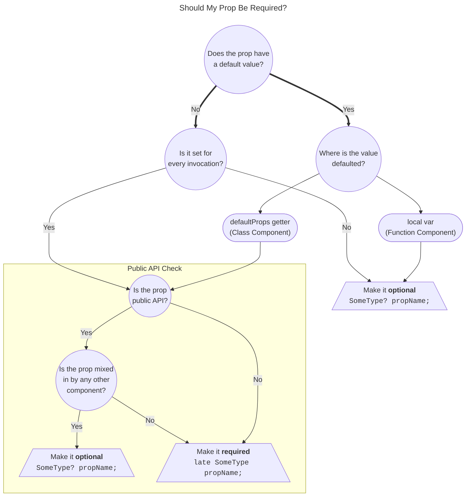

# Dart Null Safety Migration Guide

> [!NOTE]
> For Workiva employees, also refer to this more detailed Workiva-specific [migration guide](https://github.com/Workiva/dart_null_tools/blob/master/workiva_migration_guide.md).

Steps to migrate a repo to null safety:

1. [View resources](#step-1-view-resources)
1. [Run the preparation codemods](#step-2-run-the-preparation-codemods)
1. [Enable the analyzer plugin](#step-3-enable-the-analyzer-plugin)
1. [Run the migration tool](#step-4-run-the-migration-tool)

## Step 1: View resources

If you haven't already, familiarize yourself with the concepts of Dart null safety with the following resources:

- Dart's [Understanding null safety](https://dart.dev/null-safety/understanding-null-safety) article 
- OverReact's documentation on [null safety and required props](../null_safety_and_required_props.md)

## Step 2: Run the preparation codemods

There are two different codemods that can help migrate your over_react code to null safety. 
One of them should be run prior to a migration, the other should be run at the beginning of the migration itself.

### Codemod to run before a null safety migration

Before you begin a null safety migration, you should run the `null_safety_prep` [codemod][orcm] on your repo.
**These changes should be reviewed / merged prior to the null safety migration begins.**

```bash
dart pub global activate over_react_codemod
dart pub global run over_react_codemod:null_safety_prep --yes-to-all
```

This codemod will:
- Migrate as many over_react specific use cases as possible.
- Get the repo into a state where the migration tool can be run with less manual intervention.

### Codemod to run as part of a null safety migration

Once you're ready to begin a null safety migration, run the `null_safety_migrator_companion` codemod, and commit the
hints it adds as a separate commit before proceeding with the rest of the migration. 

```bash
dart pub global activate over_react_codemod
dart pub global run over_react_codemod:null_safety_migrator_companion --yes-to-all
```

This codemod will:
- Add nullability hints to props/state that are defaulted/initialized in class components.
  - These hints will cause defaulted/initialized values to be migrated as "late required". 
    See our [prop nullability](#prop-nullability) docs for more details on whether you should keep them required following the migration.

## Step 3: Enable the analyzer plugin

Enabling the analyzer plugin will help you spot potential null-safety issues in your components at analysis time,
especially as it pertains to [prop nullability](#prop-nullability).

1. Enable the plugin in your `analysis_options.yaml` file:
    ```yaml
    analyzer:
      plugins:
        - over_react
    ```
1. Restart the Dart Analysis Server in your IDE. The plugin may take a minute to load after built-in analysis completes.

   * If the number of new lints / errors is overwhelming, you an also use this snippet to disable all lints except for the ones that are particularly useful during a null-safety migration:
       ```yaml
       analyzer:
         plugins:
           over_react
     
       over_react:
         errors:
           over_react_exhaustive_deps: ignore
           over_react_invalid_render_return_type: ignore
           over_react_pseudo_static_lifecycle: ignore
           over_react_rules_of_hooks: ignore
           over_react_style_missing_unit: ignore
           over_react_avoid_link_target_vulnerability: ignore
           over_react_boilerplate_warning: ignore
           over_react_create_ref_usage: ignore
           over_react_forward_only_dom_props_to_dom_builders: ignore
           over_react_hash_code_as_key: ignore
           over_react_invalid_dom_attribute: ignore
           over_react_low_quality_key: ignore
           over_react_missing_cascade_parens: ignore
           over_react_missing_key: ignore
           over_react_object_to_string_as_key: ignore
           over_react_proptypes_do_not_throw: ignore
           over_react_unknown_key_type: ignore
           over_react_boilerplate_debug: ignore
           over_react_bool_prop_name_readability: ignore
           over_react_consumed_props_return_value: ignore
           over_react_incorrect_doc_comment_location: ignore
           over_react_prefer_null_over_false_render_return_type: ignore
           over_react_prefer_use_or_create_ref: ignore
           over_react_string_ref: ignore
           over_react_unnecessary_key: ignore
           over_react_variadic_children: ignore
       ```

## Step 4: Run the migration tool

> [!TIP]
> **Be sure to commit any changes from step 3 prior to running the migrator tool!**

Run the null safety migrator tool:

- **For Workiva employees, use the [Workiva version of the migrator tool](https://github.com/Workiva/wnnbd?tab=readme-ov-file#migrating-a-package).**
  - Note that there may be additional preparation steps recommended in the documentation for that tool.
- Otherwise, either:
  - use [Dart's migrator tool](https://dart.dev/null-safety/migration-guide#migration-tool)
  - use [a fork of the migrator tool](#migrator-tool-bug) that fixes a bug with how over_react usages are migrated

### Common migration cases

Below are some common cases that might come up while running the migrator tool on a repo using over_react.

#### Prop nullability

First, check out our documentation around [null safety and required props](../null_safety_and_required_props.md).

To determine if a prop should be nullable or not, first consider if the prop is required.

> [!WARNING]
> Making a prop required with the `late` keyword can be a breaking change if consumers are not always setting the prop.

Below is a table of the possible options for prop nullability:

|                | Required (`late`)    | Optional        |
|----------------|----------------------|-----------------|
| Nullable (`?`) | `late String? prop;` | `String? prop;` |
| Non-nullable   | `late String prop;`  | n/a             |

- (_most common_) All **optional** props should be made **nullable**.
- **Required** props can be nullable or non-nullable:
  - **Nullable**: If the prop is required, but can be explicitly set to `null`.
  - **Non-nullable**: If the prop is required and should never be set to `null`.

> [!TIP]
> **Determining prop nullability manually can be extremely tedious and error-prone.**
>
> If you are a Workiva employee, and you don't want to have to go through the process shown
> in the decision tree below for every prop in every component in your library, you should wait for the
> [codemod that is being built](https://jira.atl.workiva.net/browse/FED-1885) before migrating your UI
> components since it will automate the vast majority of this process.



#### Implementing abstract `Ref`s

After migrating to null-safety, it may be necessary to add left side typing on `Ref`s when overriding abstract getters as shown in the example below:

```dart
// in some_abstract_component_or_mixin
abstract class AbstractFoo extends UiComponent2 {
  Ref<AbstractFooPrimitiveComponent?> get someRef;
}

// in impl
class Foo extends AbstractFoo {
  // Incorrectly inferred as Ref<Object?>
  @override
  final someRef = createRef<FooPrimitiveComponent>(); 
  
  // Correctly typed as Ref<FooPrimitiveComponent?>
  @override
  final Ref<FooPrimitiveComponent?> someRef = createRef();
}
```

#### Incorrect `getDerivedStateFromProps` Return Signature

The migrator often incorrectly makes the return signature of `getDerivedStateFromProps` non-nullable.

The correct null-safe signature for this class component method is:

```dart
Map? getDerivedStateFromProps(Map nextProps, Map prevState) {}
```

#### Verbose function component return signature for `uiForwardRef`

If you are migrating `uiForwardRef` components that lack an explicit return signature on the left side like this:

```dart
final SomeComponent = uiForwardRef<SomeComponentProps>(/*...*/);
```

the migrator tool will add some very verbose left side typing based on type inference. **Changes like this are safe to discard.**

```dart
final SomeComponentProps Function([Map<dynamic, dynamic>]) SomeComponent = uiForwardRef<SomeComponentProps>(/*...*/);
```

#### Nullable store/actions generics on `FluxUiPropsMixin`

The migrator tool attempts to infer the nullability of `FluxUiPropsMixin.store` / `FluxUiPropsMixin.actions` based
on usage - which can lead to the type generics being incorrectly migrated as nullable types. 

**These generics should always be set with non-nullable types.**

```dart
// Incorrect
class FooProps = UiProps with FluxUiPropsMixin<SomeActionsType?, SomeStoreType?>;

// Correct
class FooProps = UiProps with FluxUiPropsMixin<SomeActionsType, SomeStoreType>;
```

#### Nullable props generic on `UiComponent2` mixins

When you have a component mixin that contains a generic which has a base type of a props mixin like so:

```dart
mixin FooProps on UiProps {/*...*/}

mixin Foo<TProps extends FooProps> on UiComponent2<TProps> {/*...*/}
```

The migrator tool sometimes incorrectly infers `UiComponent2.props` as nullable like so:

```dart
mixin FooProps on UiProps {/*...*/}

// Incorrect. FooProps? should be non-nullable FooProps
mixin Foo<TProps extends FooProps?> on UiComponent2<TProps> {/*...*/}
```

**Generic props applied to the `UiComponent2` constraint should always be non-nullable.**

### Migrator Tool Bug

#### Migrator treats emulated function calls as nullable

> [!TIP]
> **If you are a Workiva employee, this bug is fixed in [the official Workiva fork of the migrator](https://github.com/Workiva/dart_null_tools), so there is no need to read any further.**

The migrator tool [incorrectly treats the result of emulated function calls as nullable](https://github.com/dart-lang/sdk/issues/46263).

The most common way this affects over_react is in cases like this:
```dart
// The over_react code:
var content = Dom.div()();

// gets incorrectly migrated to:
ReactElement? content = Dom.div()();
```

To work around this issue, you can either:
- manually fix these after running the migrator
- use a fork of the migrator tool that contains a bugfix - see the following section for instructions on how to run that locally

<details>
  <summary><strong>Using the forked migrator tool</strong> <em>(Not relevant for Workiva employees)</em></summary>
  
  The `dart migrate` tool comes bundled with the Dart SDK, so we'll need a local copy of the SDK to pull in [a fix](https://github.com/dart-lang/sdk/issues/46263#issuecomment-967647710) for it.

  First, clone the Dart SDK using the instructions from the Dart SDK wiki (just cloning the repo normally won't work). The only steps on this wiki you need to follow are:
  1. [Dependencies](https://github.com/dart-lang/sdk/wiki/Building#dependencies)
  2. [Getting the source](https://github.com/dart-lang/sdk/wiki/Building#source)
  
  After that's done, we'll check out the branch containing the bugfix, and get the migrator tool ready to run:
  ```sh
  # Enter the dart-sdk/sdk directory we set up above
  cd sdk
  
  # Check out the forked Dart SDK branch with the fix from:
  # https://github.com/dart-lang/sdk/issues/46263#issuecomment-967647710
  git remote add sdk-fork https://github.com/greglittlefield-wf/sdk.git
  git fetch sdk-fork
  git checkout fix-emulated-function-migration-2.19
  
  # After changing branches, update files needed for generate_package_config  
  gclient sync -D --nohooks
  
  # Generate a package config in place of doing `pub get` (the Dart SDK's package setup is special),
  # allowing us to run the migrator tool.
  dart tools/generate_package_config.dart
  ```
  
  Now, we're all set!
  
  In place of running `dart migrate`, we can run our local copy of the migrator tool. Start in the package you want to migrate, then run the tool located at `pkg/nnbd_migration/bin/migrate.dart` within the Dart SDK clone.
  ```sh
  cd your_package
  # This can be an absolute or relative path
  dart /full/path/to/dart-sdk/sdk/pkg/nnbd_migration/bin/migrate.dart
  ```
  
  This command behaves the same as `dart migrate`, and accepts the same arguments it does.
</details>

[orcm]: https://github.com/Workiva/over_react_codemod
