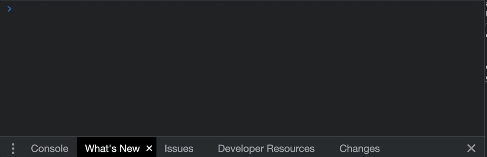
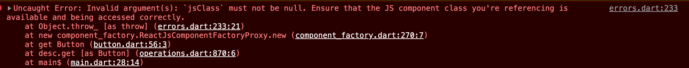

# Wrapping JS Components

This document talks about using the `uiJsComponent` API to create a Dart component API that wraps an existing JS component. For example, if you need to consume a component from an open source JS library in Dart, you would need to wrap that component with an interop layer. The `uiJsComponent` API exists to take care of wrapping the primary component API, along with adding a space to declare prop typings using the same `mixin` based syntax that OverReact supports.

## tl;dr

The details of this document are important as there are multiple gotchas that can take the form of runtime errors, undetectable until a particular edge case is hit by a user. Therefore, it is **highly recommended** that the entirety of this guide is read and understood before adopting this pattern. That being said, it may be useful to have a holistic view of what this approach looks like. The collapsed summary region below cantains a full example of wrapping a JS component that can be used as a reference or template.

<details>

  <summary>Summary</summary>

```dart
@JS() /* [1] */
library some_library.path.to.component;

import 'package:js/js.dart';
import 'package:over_react/over_react.dart';

part 'some_js_component.over_react.g.dart'; /* [2] */

/* [3] */ UiFactory<SomeJsComponentProps> SomeJsComponent = uiJsComponent(
  ReactJsComponentFactoryProxy(_jsSomeJsComponent), /* [4] */
  _$SomeJsComponentConfig, // ignore: undefined_identifier
);

@Props(keyNamespace: '') /* [5] */
mixin SomeJsComponentProps on UiProps {
  String aProp; /* [6] */
 }

@JS('MagicalJsPackage.SomeJsComponent') /* [7] */
external ReactClass get _jsSomeJsComponent; /* [8] */
```

Below are more detailed explanations of each part of the code. Each of these points correlates to a more thorough section that adds as much information as possible.

1. Add the `JS()` annotation and a library directive. Because this is a file implementing JS interop, it is necessary to use the `JS()` annotiation. A library directive is necessary when using the `JS()` annotation. The actual library name is not important as far as the wrapping and interop go, but it should be unique to the component.
1. Add the `part` directive. Just like any other OverReact component, the file needs to have a `part` that matches the file's name. Nothing special needs to be done here as far as wrapping the JS component goes.
1. Invoke `uiJsComponent`. Note that the left hand side of the declaration looks exactly like a standard, all-Dart functional component declaration. However, instead of `uiFunction`, the API being use is `uiJsComponent`.
1. Wrap the JS interop variable with `ReactJsComponentFactoryProxy`. The JS variable (`_jsSomeJsComponent` in this case) is defined below. `ReactJsComponentFactoryProxy` is a wrapper that understands how to create a React element (in Dart) from the JS component.
1. Set the prop's namespace to be empty. JS component's do not have a key namespace like OverReact components do. Therefore, in order to set props as expected, there should be no namespace.
1. Add types for the props. In the cases where types map one-to-one from JS to Dart, this will be pretty easy. There are more challenging cases to watch out for, though. For more information, see the [Adding Prop Typings](#adding-prop-typings) section.
1. Annotate the JS variable. This anotation should match the component's name on the JS side, including any namespacing that's happening on the JS side.

   For example, in this case, the component comes from a library called `MagicalJsPackage`. The component's name is `SomeJsComponent`, and in the JS world, could be used in JSX like:

   ```jsx
   <SomeJsComponent />
   ```

   Together, that means that the reference needs to be `MagicalJsPackage.SomeJsComponent`. If this is not done correctly, a runtime error will fire.

   All in all, this could be one of the more complicated steps. For more information, see the [Adding a JS Variable](#adding-the-js-variable) section for more information.

1. Create the JS variable. This step is very straightforward, with eleboration only necessary to note that the name of the variable can be anything. Our norm is `js{ComponentName}` to both tie it to and contrast it from the Dart `UiFactory`, but as far as Dart interop goes, the name isn't significant.

</details>

## Using `uiJsComponent`

`uiJsComponent` is used to create the `UiFactory` attached to the JS component. In other words, after using `uiJsComponent`, you will have a Dart `UiFactory` that can be used like a factory that was written entirely in Dart. Invoking the `uiJsComponent` itself is actually one of the simplest parts of the wrapping process and is ultimately the culmination of other steps. However, because it's the heart of the everything, we wanted to introduce it early as the cornerstone that will tie upcoming sections together.

Invoking the API looks like:

```dart
UiFactory<SomeJsComponentProps> SomeJsComponent = uiJsComponent(
  ReactJsComponentFactoryProxy(_jsSomeJsComponent),
  _$SomeJsComponentConfig, // ignore: undefined_identifier
);
```

Areas of similarity between this and a functional component declaration are:

1. The typing on the left hand side of the declaration is created the same way (`UiFactory<SomeProps>`)
1. A generated config (`_$SomeJsComponentConfig` here) is necessary and ignored by the analyzer

The differences are:

1. The correct API is `uiJsComponent` instead of `uiFunction`
1. `ReactJsComponentFactoryProxy(_jsSomeJsComponent)` is passed in instead of a function

The most notable difference is number 2. `_jsSomeJsComponent` is a JS interop variable created to reference the JS component itself. That JS variable is something we'll dive deeper into later in the [Adding the JS Variable section](#adding-the-js-variable).

The `ReactJsComponentFactoryProxy` is a wrapper for the JS component that understands how to create, within Dart, a React element from the JS component. As far as what's necessary to know for creating these components, that's it. The syntax is basically boilerplate that can be copy and pasted from component to component, just changing the JS variable to match the new component.

That being said, for those wanting some deeper context, `ReactJsComponentFactoryProxy` is the tip of a larger iceburg. When instantiating `ReactJsComponentFactoryProxy`, you may notice some optional parameters on the constructor. Those parameters are used to effect how the component handles certain interop cases for the component. They exist because `ReactJsComponentFactoryProxy` is used under the hood in several different contexts (like powering `uiForwardRef`), some of which require unique behaviors when it comes to interop.

It is unlikely that you will hit scenarios where settings these parameters is necessary, and therefore, it is generally discouraged to change them away from the default. If the wrapped component is not behaving as expected, reach out to us on [Slack][slack] so we can help!

## Adding Important Directives

The important directives for this process are:

1. The JS annotation and a library directive
1. Imports
1. Part directive

Altogether they look like:

```dart
@JS()
library some_library.path.to.component;

import 'package:js/js.dart';
import 'package:over_react/over_react.dart';

part 'some_js_component.over_react.g.dart';
```

Imports are standard (the `js.dart` import provides the `JS()` annotation) and the `part` is the same as you would expect in any OverReact component.

Something that may be new is the usage of the `JS()` annotation. This is necessary in files performing interop operations and therefore is required. The annotation must be attached to a library directive, and therefore the library directive is also required. The name of the library can be anything, with the main limitation being that it should be unique to the file.

## Adding the JS Variable

To provide a Dart component, the Dart component must wrap the JS version. This means that the JS version must be accessible in Dart. The way to do that is to use interop to create a reference to the JS API. That looks like:

```dart
@JS('MagicalJsPackage.SomeJsComponent')
external ReactClass get _jsSomeJsComponent;
```

There are two pieces here. The first piece is creating an annotation and creating a getter.

### Creating the Getter

Creating the getter is very simple. The code here can basically be copied and pasted from the code found in this doc, just changing the name of the getter to be something more specific than `_jsSomeJsComponent`. However, the name can really be anything. We have the norm of using `_js{ComponentName}` because:

- It's private by default, which is preferred because the use case for the JS veriable itself is limited
- It makes it clear it's the _JS_ version of the component, while also coupling it with the Dart API by including the component's name

You may wonder why the name doesn't need to match the name of the JS component. For example, a component named `SomeJsComponent` can have a Dart interop getter called `_jsSomeJsComponent`. This is possible because the actual link between Dart and JS is created [with the annotation](#creating-the-annotation).

### Creating the Annotation

The annotation is how Dart knows what JS API needs to be referenced. In other words, if you do:

```dart
@JS('SomeJsComponent')
```

Dart will expect to find a property on the JavaScript window, in the browser, called `SomeJsComponent`. Future references to the Dart getter then will be linked directly to that JS property on the window. This can get complicated because the exact name of the API will likely include the name of the library and any namespacing on the JS side. Ultimately, it depends on how the JavaScript is bundled and exported from that bundle.

For example, React is a JS bundle attached to the page and one of the [interop references looks like this](https://github.com/Workiva/react-dart/blob/e5d995927cbdfc6722d7313c172dd6c58dcbb586/lib/react_client/react_interop.dart#L359-L366):

```dart
@JS('React.PropTypes')
abstract class PropTypes {
  // ...
}
```

Here we're focusing on the annotation. The package is "React" and the API exported from that package is "PropTypes". Typically, wrapping a component from a JS library will look similar and the annotation will be something like:

```dart
@JS('MagicalJsPackage.SomeJsComponent')
```

> Reminder: The JavaScript bundle for the JS must be added to the HTML page as script, [similar to how React is added](https://github.com/Workiva/react-dart/blob/e5d995927cbdfc6722d7313c172dd6c58dcbb586/example/js_components/index.html#L19-L20), or else this interop step will always fail.

To check that the correct name is, you can use the browser devtools to attempt to access the property on the window.



If the annotation does not have the correct name, rendering the component will fail with a runtime error that looks like:



> **NOTE** if after correctly creating the annotation, you find that it does not have a library prefix and only requires the component name (i.e. `JS('SomeJsComponent')` and not something like `JS('MagicalJsPackage.SomeJsComponent')`), you should **heavily** consider configuring your bundle to have at least a package namespace (i.e. the 'MagicalJsPackage' prefix). Attaching components to the global namespace both pollutes that namespace as well as risks naming collisons.

## Adding Prop Typings

The last step is creating a props mixin for the component. In its simplest form, this props mixin is purely to add type safety when using the component in Dart. In other words, in simple cases, you're just adding a property to the props mixin that lines up with a prop on the JS side, and Dart will handle converting that data from Dart to JavaScript.

However, there are special cases that require processing the data manually instead of letting Dart do the translation. These are cases that can cause runtime errors if not handled correctly.

### Manually Processing Prop Data

While most Dart and JS types get converted nicely during interop, some cases require manual intervention in order to be handled correctly. These cases are:

- Any JS type that translates to a Dart `Map` type
- React `ref` types

Props with those types require special utilities (such as `jsifyMapProp`) in order to behave correctly. These utilities were built, and have [exhaustive test coverage](https://github.com/Workiva/over_react/blob/master/test/over_react/util/prop_conversion_test.dart), to be sure that the data is handled precisely. While these circumstances are documented further in the [Supplemental Explanations section](#supplamental-explanations), it bears repeating that props with these types should be watched for and handled carefully.

### Props Conversion Tables

These are tables that helps illustrate the typing of a prop in TypeScipt and Dart. If the library you're wrapping does not have explicit types in TypeScript for the components, it may have `PropTypes` that are fairly similar. If no types are available, erroring on the safe side is best as Dart can throw runtime errors if the type is incorrect. Some conversions are explained further in the [Supplemental Explanations section](#supplamental-explanations).

> **NOTE** that these tables are not exhaustive. They try to cover the major types that are likely to come up but don't include every type and variation that TS allows for.

#### Standard Types

| TypeScript                   | Dart                        | Notes                                                                                                                                                                                      |
| ---------------------------- | --------------------------- | ------------------------------------------------------------------------------------------------------------------------------------------------------------------------------------------ |
| `number`                     | `num`                       |                                                                                                                                                                                            |
| `string`                     | `string`                    |                                                                                                                                                                                            |
| `boolean`                    | bool                        |                                                                                                                                                                                            |
| `Array<T>` \| `T[]`          | `List<T>`                   |                                                                                                                                                                                            |
| `unknown`                    | `dynamic`                   |                                                                                                                                                                                            |
| `any`                        | `dynamic`                   |                                                                                                                                                                                            |
| `null`                       | `null`                      |                                                                                                                                                                                            |
| `undefined`                  | `null`                      |                                                                                                                                                                                            |
| `void`                       | `void`                      |                                                                                                                                                                                            |
| any union of different types | `dynamic`                   | The exception is if the union is something like `null \| boolean`. TS is non-nullable by default, so they must specify `null`, whereas interop will work fine just typing it as `boolean`. |
| union of `T` literals        | T                           | For example, a union like `'foo' \| 'bar' \| 'baz'` is a union of all strings. In that case, the prop type would be `String`.                                                              |
| `(foo: string) => boolean`   | `bool Function(String foo)` |                                                                                                                                                                                            |

#### Exotic Types

Some TS types are either complex, either mapping directly to an existing React type or requiring more intricate getters and setters.

| TypeScript                                                              | TypeScript Example                                                                                        | Dart                                                             | Dart Example                                                                                                    |
| ----------------------------------------------------------------------- | --------------------------------------------------------------------------------------------------------- | ---------------------------------------------------------------- | --------------------------------------------------------------------------------------------------------------- |
| `React.ReactElement`                                                    | [MUI Chip][example_ts_reactelement]                                                                       | `ReactElement`                                                   | [RMUI Chip][example_dart_reactelement]                                                                          |
| `React.ReactNode`                                                       | [MUI Chip][example_ts_reactnode]                                                                          | dynamic                                                          | [RMUI Chip][example_dart_reactnode]                                                                             |
| anything that translates to a Dart `Map` (`interfaces`, `objects`, etc) | [MUI Autocomplete Interface][example_ts_interface], [MUI Autocomplete Anon Object][example_ts_anonobject] | See examples and the [Converting Maps section](#converting-maps) | [RMUI Autocomplete Interface][example_dart_interface], [RMUI Autocomplete Anon Object][example_dart_anonobject] |
| refs (`React.ForwardedRef`, `React.RefObject`, `React.Ref`)             | [MUI TextField Ref][example_ts_ref]                                                                       | See example and the [Converting Refs section](#converting-refs)  | [RMUI TextField Ref][example_dart_ref]                                                                          |

#### Supplamental Explanations

Some of the conversations above require additional explanation to clarify why the conversion looks the way it does.

##### Converting Maps

Props are commonly typed as something that's shaped like a Dart `Map`. Anything with keys and values fall into that category, which can be anything that looks like:

```ts
// Each prop here is a different form of an object type
interface SomeJsComponentProps {
  aDifferenceInterface: AnotherInterface;
  aType: AnotherType;
  anonObjectType: {
    propA: string;
    propB: string;
  };
}

interface AnotherInterface {
  propA: string;
}

type AnotherType = {
  propA: string;
};
```

JavaScript `object`s and Dart `Map`s do not convert automatically like primitives do. In order to allow the data to be passed from Dart to JavaScript, interop utilites must be used. Converting any one of those map props looks like:

```dart
mixin SomeJsComponentProps on UiProps {
  Map get aMapProp => unjsifyMapProp(_aMapProp$rawJs);

  set aMapProp(Map value) => _aMapProp$rawJs = jsifyMapProp(value);

  @Accessor(key: 'aMapProp')
  JsMap _aMapProp$rawJs;
}
```

The steps are:

1. Create a `JsMap` property that will represent the raw JS data for the component. This is necessary because the raw JS is not in a consumable form and should not be accessed directly.
1. Add an `@Accesssor` annotation to the property with a key that matches the prop name. This will link the `JsMap` property to the JS prop.
1. Add `Map` getters and setters named the same as the prop.
   - The getter should use `unjsifyMapProp` to convert the JS property to a Dart `Map`
   - The setter should use `jsifyMapProp` to convert the Dart map to JS.

##### Converting Refs

If you read [Converting Maps](#converting-maps), this section will be very similar (just with different interop utilities). Say you have props that look like:

```ts
interface SomeJsComponentProps {
  aRef: React.Ref<any>;
  anotherRef: React.RefObject<any>;
  aForwardedRef: React.ForwardedRef<any>;
}
```

Refs are special JS object types that need to be converted to and from Dart using interop utilities. Converting any one of those ref types looks like:

```dart

mixin SomeJsComponentProps on UiProps {
  dynamic get someRef => unjsifyRefProp(_someRef$rawJs);

  set someRef(dynamic value) => _someRef$rawJs = jsifyRefProp(value);

  @Accessor(key: 'someRef')
  dynamic _someRef$rawJs;
}
```

The steps are:

1. Create a `dynamic` property that will represent the raw JS ref property for the component. This is necessary because the raw JS is not in a consumable form and should not be accessed directly.
1. Add an `@Accesssor` annotation to the property with a key that matches the prop name. This will link the Dart ref property to the JS prop.
1. Add ref getters and setters named the same as the prop.
   - The getter should use `unjsifyRefProp` to convert the JS property to a Dart `Map`
   - The setter should use `jsifyRefProp` to convert the Dart map to JS.

##### Converting Conflicting Function Props

Some function props may conflict with the `UbiquitousDomPropsMixin`. This will happen if:

1. The component specifies a function that is typically reserved for `UbiquitousDomPropsMixin`. These are typically fundamental event handlers on HTML elements, such as `onClick`, `onChange`, etc.
1. The component's prop's function signature is not the same. This typically takes the form of adding extra parameters that the standart event handlers do not have.

This causes problems in Dart because if the type of the function signature does not match what Dart expects, it will throw a runtime error. Here's what that could look like in TS:

```ts
interface SomeJsComponentProps {
  // note that the `id` parameter isn't usually part of the `onClick` handler signature
  onClick: (e: React.MouseEvent, id: string) => void;
}
```

in Dart, to work around that, you would do something like:

```dart
mixin SomeJsComponentProps on UiProps {
 @Accessor(key: 'onClick')
  void Function(SyntheticMouseEvent event, String id) onClick_SomeJsComponent;

   @Deprecated('Use onClick_SomeJsComponent for proper typing')
  @override
  get onClick;

  @Deprecated('Use onClick_SomeJsComponent for proper typing')
  @override
  set onClick(value);
}
```

The steps are:

1. Add overridden getters and setters for the function. Overriding is necessary because `UiProps` already contributes the property.
1. Deprecate those getters and setters. This isn't necesssary to avoid runtime errors, but it's an important step because those properties should not be accessed by consumers.
1. Add a new property that has the correct type for the function. We recommend using the original prop name and adding a namespace suffix (i.e. `onClick` becomes `onClick_SomeJsComponent`). That way, even though the property can't be the same name as the original prop itself (i.e. `onClick`), it allows developers to begin typing the name of the original prop and use autocomplete from there.
1. Add an `Accessor()` annotation with a key matching the name of the original prop. This links the namespaced prop to the the JS property it is replacing.

### Props Conversion Example

Say you are given a props interface (or type) that looks like:

```ts
interface SomeJsComponentProps {
  childRef: React.Ref<any>;
  content: string;
  onClick: (e: React.MouseEvent, id: string) => void;
  size: 2 | 4 | 6 | 8;
}
```

In Dart, that would look like:

```dart
mixin SomeJsComponentProps on UiProps {
  // START REF PROP
  dynamic get childRef => unjsifyRefProp(_childRef$rawJs);

  set childRef(dynamic value) => _childRef$rawJs = jsifyRefProp(value);

  @Accessor(key: 'childRef')
  dynamic _childRef$rawJs;
  // END REF PROP

  String content;

  // START ONCLICK
    @Accessor(key: 'onClick')
  void Function(SynethicMouseEvent event, String id) onClick_SomeJsComponent;

  @Deprecated('Use onClick_SomeJsComponent for proper typing')
  @override
  get onClick;

  @Deprecated('Use onClick_SomeJsComponent for proper typing')
  @override
  set onClick(value);
  // END ONCLICK

  num size;
}
```

## Testing Your Dart Component

Now that you have a fully-fledged Dart wrapper for your JS component, you'll want to add some tests! Hopefully the library exporting the JS component has adequate tests for the actual functionality, so the tests to be added on the Dart side are those that exercise the interop. We highly recommend two different tests:

1. A test to verify the component mounts without errors
1. Tests for any function props

More test cases may be necessary, or simply preferred, but those should be considered the baseline to start from.

### Test to Verify Component Mount

This is largely a sanity check to be sure interop is working as expected. It's ultimately verifying that:

- the JS component is found on the window. See the [Creating the Annotation section](#creating-the-annotation) for more information
- the Dart component can build (i.e. no boilerplate errors)
- any default logic the component runs on mount is compatible with the Dart interop

This test may look something like:

```dart
test('SomeJsComponent renders without error', () {
  final errors = [];
  rtl.render(
    (ErrorBoundary()
      ..onComponentDidCatch = (error, _) {
        errors.add(error);
      }
    )(
      SomeJsComponent()(),
    ),
    wrapper: StrictMode,
  );
  expect(errors, isEmpty);
});
```

The breakdown of this test is:

1. Wrap the component in a basic error boundary that will catch potential errors
   - Be sure to use the `StrictMode` component to catch errors that will only show in that context
1. Render the component
1. Verify the list of errors is empty

### Testing Function Props

Function props can be deceptively tricky to wrap correctly. Fundamentally it's important to check that all the parameters can get converted from Dart to JS as expected, but explicitly testing it via UI interactions also ensures that the JS component invokes it as expected. JavaScript is not strict on the arity of functions. A JS package may advertise that a function has a specific type but then actually invoke it with paremeters that Dart does not expect. This will cause a runtime error in Dart.

To guard against that, it is recommended to write a test for every function prop that was wrapped. One of these tests may look like:

```dart
test('onClick', () {
  final events = [];
  final view = rtl.render(
    (Button()..onClick = (e) => events.add(e))(),
    wrapper: StrictMode,
  );
  UserEvent.click(view.getByRole('button'));
  expect(events, [isA<SyntheticMouseEvent>()]);
});
```

This test is:

1. Rendering the component in a strict mode wrapper
1. Getting clicked
1. Checking that an event of the specific type was fired

Most tests like this can be that simple because typically the most important thing is just that the function fires as expected without dismounting the React tree.

## Conclusion

Hopefully wrapping your JS component goes smoothly! However, even simple components can have highly unique situations that cause challenges. If you encounter any of those challenges, please reach out to us in [Slack][slack]!

[slack]: https://workiva.slack.com/archives/CEFTMBPAA
[example_ts_reactelement]: https://github.com/mui/material-ui/blob/d73fadbb12cc48a981a39d4ccaeacd8021ab9efa/packages/mui-material/src/Chip/Chip.d.ts#L19
[example_dart_reactelement]: https://github.com/Workiva/react_material_ui/blob/4fc41fe8393b424beac513ec99a98be5f09bd1ab/lib/src/components/custom/wsd/chip/chip.dart#L36
[example_ts_reactnode]: https://github.com/mui/material-ui/blob/d73fadbb12cc48a981a39d4ccaeacd8021ab9efa/packages/mui-material/src/Chip/Chip.d.ts#L64
[example_dart_reactnode]: https://github.com/Workiva/react_material_ui/blob/4fc41fe8393b424beac513ec99a98be5f09bd1ab/lib/src/components/custom/wsd/chip/chip.dart#L69
[example_ts_interface]: https://github.com/mui/material-ui/blob/d73fadbb12cc48a981a39d4ccaeacd8021ab9efa/packages/mui-material/src/Autocomplete/Autocomplete.d.ts#L92
[example_ts_anonobject]: https://github.com/mui/material-ui/blob/d73fadbb12cc48a981a39d4ccaeacd8021ab9efa/packages/mui-material/src/Autocomplete/Autocomplete.d.ts#L120-L125
[example_dart_interface]: https://github.com/Workiva/react_material_ui/blob/4fc41fe8393b424beac513ec99a98be5f09bd1ab/lib/src/components/mui_material/autocomplete/autocomplete.dart#L75-L83
[example_dart_anonobject]: https://github.com/Workiva/react_material_ui/blob/4fc41fe8393b424beac513ec99a98be5f09bd1ab/lib/src/components/mui_material/autocomplete/autocomplete.dart#L120-L132
[example_ts_ref]: https://github.com/mui/material-ui/blob/d73fadbb12cc48a981a39d4ccaeacd8021ab9efa/packages/mui-material/src/TextField/TextField.d.ts#L98
[example_dart_ref]: https://github.com/Workiva/react_material_ui/blob/4fc41fe8393b424beac513ec99a98be5f09bd1ab/lib/src/components/custom/wsd/text_field/text_field.dart#L175-L187
