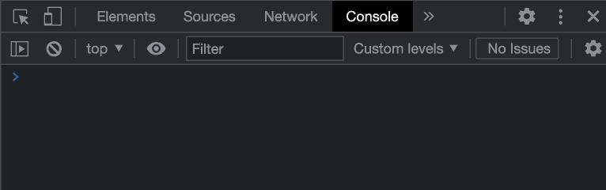

# Wrapping JS Components

This guide will walk you through the process of wrapping a JavaScript React component in Dart.

- **[Intro](#intro)**
- **[Theoretical Explanation](#theoretical-explanation)**
  - [Dart Level](#level-3-the-dart-level)
  - [Interop Level](#level-2-interop-level)
  - [JS Level](#level-1-javascript-land)
  - [Conclusion](#theoretical-conclusion)
- **[Implementation](#implementation)**
  - [Pre-Requisites](#pre-requisites)
  - [Adding the JS Variable](#adding-the-js-variable)
    - [Adding the Directives](#adding-the-directives)
    - [Creating the Getter](#creating-the-getter)
    - [Creating the Annotation](#creating-the-annotation)
  - [Adding Prop Typings](#adding-prop-typings)
    - [Props Conversion Example](#props-conversion-example)
    - [Props Conversion Tables](#props-conversion-tables)
      - [Standard Types](#standard-types)
      - [Exotic Types](#exotic-types)
      - [Supplemental Explanations](#supplemental-explanations)
        - [Conversion through Getters and Setters](#conversion-through-getters-and-setters)
        - [Converting JS Objects](#converting-javascript-object-types)
        - [Converting Refs](#converting-refs)
        - [Converting Conflicting Function Props](#converting-conflicting-function-props)
  - [Using uiJsComponent](#using-uijscomponent)
  - [Testing Your Dart Component](#testing-your-dart-component)
    - [Test to Verify Component Mount](#test-to-verify-component-mount)
    - [Testing Function Props](#testing-function-props)
- **[Conclusion](#conclusion)**

## Intro

The JavaScript community is full of great open source libraries that export React components. These JavaScript components can be consumed in Dart by using JS interop to wrap the component and expose a Dart API for it. This process ultimately looks like writing a new Dart OverReact component, with the exception that the Dart component is linked to a JS implementation instead of a Dart one.

You must wrap the JS component in such a way that it follows OverReact's pattern of using `UiFactory` to create a props instance capable of building a `ReactElement`. This is possible with `uiJsComponent`, which takes in a `ReactJsComponentFactoryProxy` that points to a raw JS component included on the `window`.

This guide as a whole walks through how to do that linking process and helps make developers aware of the pitfalls that can cause trouble. This section in particular includes a high level technical description of that whole process. Future sections dive deeper into each step to explain why steps happen as they do or explain things to watch out for.

```dart
@JS() /* [1] */
library some_library.path.to.component;

import 'package:js/js.dart';
import 'package:over_react/over_react.dart';

part 'arbitrary_component.over_react.g.dart'; /* [2] */

/* [3] */ UiFactory<ArbitraryComponentProps> ArbitraryComponent = uiJsComponent(
  ReactJsComponentFactoryProxy(_jsArbitraryComponent), /* [4] */
  _$ArbitraryComponentConfig, // ignore: undefined_identifier
);

@Props(keyNamespace: '') /* [5] */
mixin ArbitraryComponentProps on UiProps {
  /* [6] */
  Map get aMapProp => unjsifyMapProp(_aMapProp$rawJs);

  set aMapProp(Map value) => _aMapProp$rawJs = jsifyMapProp(value);

  @Accessor(key: 'aMapProp')
  JsMap _aMapProp$rawJs;
}

@JS('MagicalJsPackage.ArbitraryComponent') /* [7] */
external ReactClass get _jsArbitraryComponent; /* [8] */
```

Each notable section of code is briefly explained below. These points are ordered from top to bottom and are not necessarily in the order it makes sense to write the actual code. Each of these sections correlates to a more thorough section later in the guide.

1. Add the `JS()` annotation and a library directive. Because this is a file implementing JS interop, it is necessary to use the `JS()` annotation. When using a `JS()` annotation, it is also necessary to have a library directive. The actual library name is not important as far as the wrapping and interop go, but it should be unique to the file.
1. Add the `part` directive. Just like any other OverReact component, the file needs to have a `part` that matches the file's name. Nothing special needs to be done here as far as wrapping the JS component goes.
1. Invoke `uiJsComponent`. Note that the left hand side of the declaration looks exactly like a standard, all-Dart functional component declaration. However, on the right hand side, instead of using `uiFunction`, the API being used is `uiJsComponent`.
1. Wrap the JS interop variable with `ReactJsComponentFactoryProxy`. The JS variable (`_jsArbitraryComponent` in this case) is defined below. `ReactJsComponentFactoryProxy` is a wrapper that understands how to create a `ReactElement` (in Dart) from the JS component.
1. Set the prop mixin's namespace to be empty. OverReact namespaces prop keys by default, so we want to turn that off. For example, we want the prop `aProp` to use the map key `'aProp'` instead of `'ArbitraryComponentProps.aProp'`.
1. Add types for the props. In the cases where types map one-to-one from JS to Dart, this is really straightforward. There are more challenging cases to watch out for, though. For more information, see the [Adding Prop Typings](#adding-prop-typings) section.
1. Annotate the JS variable. This annotation should match the global JS variable that exposes the component to be wrapped.

   For example, in this case, the component comes from a library called `MagicalJsPackage`. The component's name is `ArbitraryComponent`, and in the JS world, could be used in JSX like:

   ```jsx
   <ArbitraryComponent />
   ```

   Together, that means that the reference needs to be `MagicalJsPackage.ArbitraryComponent`. If this is not done correctly, a runtime error will fire. Depending on the JS package setup, this could be one of the more complicated steps. For more information, see the [Adding a JS Variable](#adding-the-js-variable) section.

1. Create the JS variable. This can be named anything, but our convention is to use `_js{ComponentName}`.

> **REMINDER** that these steps are just a _high level_ view of the process. Even if it feels like everything makes perfect sense, it is **highly** recommended to read the entirety of this guide to avoid insidious pitfalls and runtime errors.

## Theoretical Explanation

As a whole, this guide gives tangible steps to wrap a JS component. Those steps are important to make implementation clear, but they are the enactment of an underlying theory that deserves its own explanation.

Wrapping your JS component involves several levels of code working together. These are the same levels that OverReact uses to allow developers to use React in Dart. Because wrapping a JS component involves interaction with the lower levels, it's helpful to have a mental model for what those levels are and what they're doing.

### Level 3: the Dart level

We'll start at the top where you may be familiar with most of the concepts. The Dart level is all about using `OverReact`. OverReact is powered by the concept of a "props" instance. Props in OverReact, which are backed by the `UiProps` class, are ultimately the API used to create UI. To create new instances of your props class, a `UiFactory` is invoked. For example, take the component created in the [Intro](#intro). Invoking the `UiFactory` would look like:

```dart
final propsInstance = ArbitraryComponent();
```

Now `propsInstance` can be used to customize the element's props or to _build_ the `ReactElement`. To "build" the element is to create the `ReactElement` for the specific props instance. React can use that `ReactElement` to later render the component. Building is done by invoking the props instance.

```dart
final aReactElement = propsInstance();
```

Usually, invoking the `UiFactory` and building the `ReactElement` are done in immediate succession.

```dart
return (
  ArbitraryComponent()()
);
```

This is important context because whether the component backing the `ReactElement` comes from Dart or JavaScript, to use it with OverReact it must have a `UiFactory` that can return a props instance capable of building a `ReactElement`. The API that enables this for JS components is `uiJsComponent`. `uiJsComponent` can take in a JavaScript component and give back a `UiFactory`.

### Level 2: Interop Level

[react-dart][react-dart] is responsible for the interop level, which connects Dart with JavaScript Land. Usually it's just an implementation detail of OverReact, but it comes to the surface in this process because the `uiJsComponent` relies on a react-dart API.

When `uiJsComponent` takes in the JS component, the JS component must be wrapped in a `ReactJsComponentFactoryProxy`.

```dart
UiFactory<ArbitraryComponentProps> ArbitraryComponent = uiJsComponent(
  ReactJsComponentFactoryProxy( /* JS Component*/ _jsArbitraryComponent),
  _$ArbitraryComponentConfig,
);
```

react-dart has multiple proxies that extend from a class called [ReactComponentFactoryProxy](https://github.com/Workiva/react-dart/blob/bcc05cd110e7a72b0161558581cd4d07c1c68d89/lib/react.dart#L1311). The proxy relevant here, `ReactJsComponentFactoryProxy`, exists specifically for interacting with JS components.

A proxy's job is to know how to convert Dart props to JS and create a JS `ReactElement`. Recall that for OverReact to work, a `UiFactory` must create a props instance that can _build a `ReactElement`_. This proxy is the piece that enables the _building of a `ReactElement`_.

Usually OverReact uses APIs that obfuscate the need to create a factory proxy, but in this process it is a manual step. However, all it means is that when you invoke `uiJsComponent`, you'll pass in a `ReactJsComponentFactoryProxy` that wraps a raw JS component.

### Level 1: JavaScript Land

In order to have `ReactJsComponentFactoryProxy` wrap a JS component though, you need to be able to access your JS component in Dart. You will do this by using JS interop APIs to create a Dart getter that references the JS implementation.

```dart
@JS('MagicalJsPackage.ArbitraryComponent')
external ReactClass get _jsArbitraryComponent;
```

That getter can then be used whenever it's necessary to reference the raw JS component, such as when instantiating `ReactJsComponentFactoryProxy`.

In order for that getter to be valid though, it must be pointing to tangible JavaScript somewhere. The interop APIs look for that JavaScript as a property of the `window`. Your JavaScript component can be included in several ways, but it must happen before the `UiFactory` attempts to reference the interop getter. Otherwise, a runtime error will fire.

One way to load the JavaScript is to use a bundle like [React usually is][react-dart]. If you are wrapping a JS library without any customizations, it's likely the bundle already exists as a [UMD module](https://jameshfisher.com/2020/10/04/what-are-umd-modules/) or similar format. If you need to write your own JS or make customizations, it's necessary to create and load a custom build. If you have any questions around this, let us know in [Slack][slack]!

### Theoretical Conclusion

This section gave a high level view of how wrapping a JS component works in theory. You must wrap the JS component in such a way that it follows OverReact's pattern of using `UiFactory` to create a props instance capable of building a `ReactElement`. This is possible with `uiJsComponent`, which takes in a `ReactJsComponentFactoryProxy` that points to a raw JS component included on the `window`.

The rest of this guide will reference these same concepts as it implements the code step-by-step.

### Implementation

With the theory in mind, this section implements the necessary pieces step by step.

### Pre-Requisites

Before jumping into wrapping your component, here is a list of things to do to get set up:

- Make sure your package depends on `over_react: ^4.4.0`.
- Have a JS bundle and load the JS script in any applications that will use the component (in an `example` directory, test template, `app` directory, etc). **NOTE** that if your package is consumed by a different one, it is important to ensure that the consuming package(s) know to load the script in their applications too.
- Create a file for your component. The file name does not have to be unique for this process and can be consistent with existing naming patterns in your package.

### Adding the JS Variable

The first step is to create the interop getter to make the JS implementation accessible in Dart. The code written for this section is shown below.

```dart
@JS()
library some_library.path.to.component;

import 'package:js/js.dart';

@JS('MagicalJsPackage.ArbitraryComponent')
external ReactClass get _jsArbitraryComponent;
```

There are three pieces here:

1. Adding directives
1. Creating the getter
1. Attaching the annotation

#### Adding the Directives

To get started, add the important directives to the top of the file.

```dart
@JS()
library some_library.path.to.component;

import 'package:js/js.dart';
```

The `js.dart` import gives access to the `JS()` annotation. The `JS()` annotation is necessary because the file is defining interop APIs. Lastly, the `library` directive is necessary because the `JS()` annotation must be attached to a specific library.

#### Creating the Getter

Creating the getter is very simple.

```dart
external ReactClass get _jsArbitraryComponent;
```

The code here can basically be copied and pasted from the code found in this doc, just changing the name of the getter to be something more specific than `_jsArbitraryComponent`. However, the name can really be anything. We have the convention of using `_js{ComponentName}` because:

- It's private, which is preferred because the use case for the JS variable itself is limited
- It makes it clear it's the _JS_ version of the component, while also including the component's name and thereby coupling it with the Dart API

This name of this getter doesn't need to match the name of the JS component because the actual link between Dart and JS is created [with the annotation](#creating-the-annotation).

#### Creating the Annotation

The annotation binds the getter to a global JS property (a property on the `window`) with the specified name. For example, a getter annotated with:

```dart
@JS('ArbitraryComponent')
```

will return the result of the JS expression: `window.ArbitraryComponent`.

However, we **strongly** recommend namespacing your components by nesting them within another object, as opposed to adding them directly to the window, to avoid potential collisions with JS APIs added by other packages. Consequently, if the namespace is `MagicalJsPackage`, your annotation would look like:

```dart
@JS('MagicalJsPackage.ArbitraryComponent')
```

and would correspond to `window.MagicalJsPackage.ArbitraryComponent`.

> Reminder: The JavaScript bundle for the JS must be loaded into the application, [potentially similar to how React is added][react-script], or else this interop step will always fail at runtime.

To check that the name is correct, you can use the browser devtools to attempt to access the property on the `window`. If the property is valid and generally where you expect it to be then it's likely correct.



If the annotation does not have the correct name, rendering the component will fail with a runtime error that looks like:


> **One more reminder** that if after correctly creating the annotation, you find that it does not have a library prefix and only requires the component name (i.e. `JS('ArbitraryComponent')` and not something like `JS('MagicalJsPackage.ArbitraryComponent')`), you should **heavily** consider configuring your bundle to have at least a package namespace (i.e. the 'MagicalJsPackage' prefix). Loading components to the global namespace both pollutes that namespace as well as risks naming collisions.

### Adding Prop Typings

Next, you'll want to create the props mixin for your component. A props mixin declares props, types them, and in more advanced cases converts their values. In simple cases, you're just adding a property to the props mixin that lines up with a prop on the JS side, and [react-dart][react-dart] will handle converting that data from Dart to JavaScript. Meanwhile, other cases require manual type conversions to form the data in a way that JS can understand.

This section will give a basic example of what writing this mixin looks like and then give additional examples of more complex type conversions.

#### Props Conversion Example

Start by adding your component imports to your file, if you haven't already.

```dart
import 'package:over_react/over_react.dart';

part 'arbitrary_component.over_react.g.dart';
```

These are just the standard OverReact component directives. Altogether, the imports section of your file should look something like:

```dart
@JS()
library some_library.path.to.component;

import 'package:js/js.dart';
import 'package:over_react/over_react.dart';

part 'arbitrary_component.over_react.g.dart';
```

After that, move on to converting the TS props interface to a Dart mixin. Say you are given a props interface (or type) that looks like:

```ts
interface ArbitraryComponentProps {
  anObjProp: Record<string, bool>;
  content: string;
  onClick: (e: React.MouseEvent, id: string) => void;
  size: 2 | 4 | 6 | 8;
}
```

In Dart, that would look like:

```dart
@Props(keyNamespace: '')
mixin ArbitraryComponentProps on UiProps {
  // START MAP PROP
  Map get anObjProp => unjsifyMapProp(_anObjProp$rawJs);

  set anObjProp(Map value) => _anObjProp$rawJs = jsifyMapProp(value);

  @Accessor(key: 'anObjProp')
  JsMap _anObjProp$rawJs;
  // END MAP PROP

  String content;

  // START ONCLICK
  @Accessor(key: 'onClick')
  void Function(SyntheticMouseEvent event, String id) onClick_ArbitraryComponent;

  @Deprecated('Use onClick_ArbitraryComponent for proper typing')
  @override
  get onClick;

  @Deprecated('Use onClick_ArbitraryComponent for proper typing')
  @override
  set onClick(value);
  // END ONCLICK

  num size;
}
```

Note that some props converted to Dart nicely (`content`, `size`), while others required more intricate conversions (`ref`, `onClick`). These intricate conversions are discussed more in upcoming sections.

#### Props Conversion Tables

These are tables that help illustrate the typing of a prop in TypeScript and Dart. If the library you're wrapping does not have explicit types in TypeScript for the components, it may have `PropTypes` that are fairly similar. If no types are available, erring on the safe side is best as Dart can throw runtime errors if the type is incorrect. Some conversions are explained further in the [Supplemental Explanations section](#supplemental-explanations).

> **NOTE** that these tables are not exhaustive. They cover the major types that are likely to come up but don't include every type and variation that TS allows.

##### Standard Types

| TypeScript                   | Dart                                     | Notes                                                                                                                                                                                      |
| ---------------------------- | ---------------------------------------- | ------------------------------------------------------------------------------------------------------------------------------------------------------------------------------------------ |
| `number`                     | `num`                                    |                                                                                                                                                                                            |
| `string`                     | `String`                                 |                                                                                                                                                                                            |
| `boolean`                    | `bool`                                   |                                                                                                                                                                                            |
| `Array<T>` or `T[]`          | `List<T>`                                | For example, `Array<string>` and `string[]` would both translate to `List<String>`.                                                                                                        |
| `unknown`                    | `dynamic`                                |                                                                                                                                                                                            |
| `any`                        | `dynamic`                                |                                                                                                                                                                                            |
| `null`                       | `null`                                   |                                                                                                                                                                                            |
| `undefined`                  | `null`                                   |                                                                                                                                                                                            |
| `void`                       | `void`                                   |                                                                                                                                                                                            |
| any union of different types | `dynamic`                                | The exception is if the union is something like `null \| boolean`. TS is non-nullable by default, so they must specify `null`, whereas interop will work fine just typing it as `boolean`. |
| union of `T` literals        | T                                        | For example, a union like `'foo' \| 'bar' \| 'baz'` is a union of all strings. In that case, the prop type would be `String`.                                                              |
| `(foo: string) => boolean`   | `bool Function(String foo)`              |                                                                                                                                                                                            |
| `React.ReactElement`         | `ReactElement`                           | OverReact exports the `ReactElement` class.                                                                                                                                                |
| `React.ReactNode`            | `dynamic`                                | `React.ReactNode` is technically a union type.                                                                                                                                             |
| `React.{T}EventHandler`      | `void Function(Synthetic{T}Event event)` | Where `T` can represent a specific event. For example, `React.FocusEventHandler` -> `void Function(SyntheticFocusEvent event)`.                                                            |
| `React.{T}Event`             | `Synthetic{T}Event`                      | Where `T` can represent a specific event. For example, `React.MouseEvent` -> `SyntheticMouseEvent`.                                                                                        |
| `{T}Event`                   | `{T}Event`                               | Native web events (i.e. not React's `SyntheticEvent`) map directly to events from the `dart:html` library.                                                                                 |

##### Exotic Types

Exotic types are those that may need more care to convert. Watch carefully for these types of props as the translation to Dart may seem intuitive when it actually requires special care. These cases are discussed further in the [Supplemental Explanations section](#supplemental-explanations).

| TypeScript                                                           | TypeScript Example                                                                                       | Dart                                                                                   | Dart Example                                                                                                   |
| -------------------------------------------------------------------- | -------------------------------------------------------------------------------------------------------- | -------------------------------------------------------------------------------------- | -------------------------------------------------------------------------------------------------------------- |
| Object types (`interface`, anon object types, index signature types) | [MUI Autocomplete's ChipProps][example_ts_interface], [MUI Menu's anchorPosition][example_ts_knowntypes] | See examples and the [Converting Objects section](#converting-javascript-object-types) | [RMUI Autocomplete's ChipProps][example_dart_interface], [RMUI Menu's anchorPosition][example_dart_knowntypes] |
| refs (`React.ForwardedRef`, `React.RefObject`, `React.Ref`)          | [MUI TextField inputRef][example_ts_ref]                                                                 | See example and the [Converting Refs section](#converting-refs)                        | [RMUI TextField inputRef][example_dart_ref]                                                                    |

##### Supplemental Explanations

Some of the conversations above require additional explanation to clarify why the conversion looks the way it does.

###### Conversion through Getters and Setters

A solution you will see in several places, with slight differences, is the use of getters and setters on a props mixin. For example, you will see patterns like this:

```dart
@Props(keyNamespace: '')
mixin ArbitraryComponentProps on UiProps {
  Map get aMapProp => unjsifyMapProp(_aMapProp$rawJs);

  set aMapProp(Map value) => _aMapProp$rawJs = jsifyMapProp(value);

  @Accessor(key: 'aMapProp')
  JsMap _aMapProp$rawJs;
}
```

Each piece of this code block is described further in upcoming sections, but from a high level, patterns like this are necessary to allow the component to receive raw JS data from the JS library. When rendering a JS and Dart components together, it's possible that the JS side will attempt to pass props into the component. This situation is complex and [a full explanation exists](https://sandbox.wdesk.com/a/QWNjb3VudB8yMDAx/doc/1ce2dddb987b4b25a2e0f3a7804fc4af/r/-1/v/1/sec/1ce2dddb987b4b25a2e0f3a7804fc4af_1165).

The effect is that types which cannot be safely converted from JS to Dart should use a JS type (like `JsMap`) as the Dart type. Otherwise, it risks unexpected runtime errors due to invalid typing. To make it possible to work with these types, getters and setters are used to manually handle translation of the JS typed prop when necessary.

OverReact exports [several utilities](https://github.com/Workiva/over_react/blob/master/lib/src/util/prop_conversion.dart) to help with this. That being said, due to the complexity of the issue, there are still edge cases that are not handled perfectly. To understand the behavior of the utilities better, you can read the [test cases](https://github.com/Workiva/over_react/blob/master/test/over_react/util/prop_conversion_test.dart) that exercise both basic and edge cases. Using these utilities in practice is covered in upcoming sections.

###### Converting JavaScript Object Types

Objects in JavaScript are very common and props frequently have some sort of object type. In TypeScript, it is common to see an object defined with an index signature or with specific properties. These should be handled in different ways.

**Specific Properties**

A TS object type can enumerate specific properties in different ways.

```ts
interface ArbitraryComponentProps {
  aDifferenceInterface: AnotherInterface;
  aType: AnotherType;
  aRecord: Record<string, boolean>;
  anonObjectType: {
    propA: string;
    propB: string;
  };
}

interface AnotherInterface {
  propA: string;
}

type AnotherType = {
  propA: string;
};
```

When the properties of an object are known, the best conversion is to create a JS interop class. For example, given the TS structure of:

```ts
interface ArbitraryComponentProps {
  anonObjectType: {
    propA: string;
    propB: string;
  };
}
```

We need to create a type for `anonObjectType`. Because all its keys are defined, we can create a JS interop class to represent this prop. That would look like:

```dart
@Props(keyNamespace: '')
mixin ArbitraryComponentProps on UiProps {
  AnonObjectTypeObject /* [6] */ anonObjectType;
}

@JS() /* [1] */
@anonymous /* [2] */
class AnonObjectTypeObject /* [3] */ {
  /* [4] */ external factory AnonObjectTypeObject({
    String propA,
    String propB,
  });

  /* [5] */
  external String get propA;
  external set propA(String value);

  external String get propB;
  external set propB(String value);
}
```

Breaking this down into its parts:

1. **Annotate the class with the `JS()` annotation.** This tells Dart that this is an interop class that represents a JS class.
1. **Annotate the class with the `@anonymous` annotation** This means that the class does not have a tangible constructor to use when creating the class. When the TS type being converted is an _object_ and not a formal _class_, this will usually be the case. This pattern tends to be more common in JS than using formal classes.
1. **Name the class anything.** The name is not significant to interop, but we have the convention of naming it very closely to the prop it's representing.
1. **Create a factory for the class.** Because there is no constructor, this is how developers can create instances of the class to pass into the prop. There should be a named parameter for every property on the class.
1. **Add getters and setters.** This allows data to be read and written to the instance.
1. **Use the class as the type for the prop.** Now that the class is defined, the props mixin should use it as the type for the relevant prop.

Depending on the TS type, there may be variations to the listed steps. If you encounter a type that looks similar to this but slightly different and you have questions regarding conversion, reach out to us in [Slack][slack]!

**Index Signature**

An object defined as just an index signature (on a props definition) looks like:

```ts
interface ArbitraryComponentProps {
  anIndexSignatureType: {
    [aKey: string]: boolean;
  };
}
```

The differentiator between this object type and that of the previous section is that the prop type does not have known keys and values. Anytime this is true, the best conversion is a Dart `Map`. However, `Map`s need special handling. In order to allow the data to be converted to a form JavaScript can understand, interop utilities must be used. Converting any one of those map props looks like:

```dart
@Props(keyNamespace: '')
mixin ArbitraryComponentProps on UiProps {
  Map get aMapProp => unjsifyMapProp(_aMapProp$rawJs);

  set aMapProp(Map value) => _aMapProp$rawJs = jsifyMapProp(value);

  @Accessor(key: 'aMapProp')
  JsMap _aMapProp$rawJs;
}
```

> **For more information** on why getters and setters are used here, see the [Conversion through Getters and Setters section](#conversion-through-getters-and-setters).

The steps are:

1. Create a `JsMap` property that will represent the raw JS data for the component. This is necessary because the raw JS is not in a consumable form and should not be accessed directly.
1. Add an `@Accessor` annotation to the property with a key that matches the prop name. This will link the `JsMap` property to the JS prop.
1. Add `Map` getters and setters named the same as the prop.
   - The getter should use `unjsifyMapProp` to convert the JS property to a Dart `Map`
   - The setter should use `jsifyMapProp` to convert the Dart `Map` to JS.

###### Converting Refs

If you read the "Index Signature" section of [Converting Maps](#converting-maps), this section will be very similar (just with different interop utilities). Say you have props that look like:

```ts
interface ArbitraryComponentProps {
  aRef: React.Ref<any>;
  anotherRef: React.RefObject<any>;
  aForwardedRef: React.ForwardedRef<any>;
}
```

Refs are special JS object types that need to be converted to and from Dart using interop utilities. Converting any one of those ref types looks like:

```dart
@Props(keyNamespace: '')
mixin ArbitraryComponentProps on UiProps {
  dynamic get someRef => unjsifyRefProp(_someRef$rawJs);

  set someRef(dynamic value) => _someRef$rawJs = jsifyRefProp(value);

  @Accessor(key: 'someRef')
  dynamic _someRef$rawJs;
}
```

> **For more information** on why getters and setters are used here, see the [Conversion through Getters and Setters section](#conversion-through-getters-and-setters).

The steps are:

1. Create a `dynamic` property that will represent the raw JS ref property for the component. This is necessary because the raw JS is not in a consumable form and should not be accessed directly.
1. Add an `@Accessor` annotation to the property with a key that matches the prop name. This will link the Dart ref property to the JS prop.
1. Add ref getters and setters named the same as the prop.
   - The getter should use `unjsifyRefProp` to convert the JS property to Dart.
   - The setter should use `jsifyRefProp` to convert the Dart map to JS.

###### Converting Conflicting Function Props

Some function props may conflict with props that are built into the UiProps base class, which get mixed in from `UbiquitousDomPropsMixin`. This will happen if:

1. The component specifies a function that is typically reserved for `UbiquitousDomPropsMixin`. These are typically event handlers on HTML elements, such as `onClick`, `onChange`, etc.
1. The prop's function signature is not the same as the version on `UbiquitousDomPropsMixin`. This typically takes the form of adding extra parameters that the standard event handlers do not have.

This causes problems in Dart because if the type of the function signature does not match what Dart expects, it will throw a runtime error. Here's what that could look like in TS:

```ts
interface ArbitraryComponentProps {
  // note that the `id` parameter isn't usually part of the `onClick` handler signature
  onClick: (e: React.MouseEvent, id: string) => void;
}
```

In Dart, to work around that, you would do something like:

```dart
@Props(keyNamespace: '')
mixin ArbitraryComponentProps on UiProps {
  @Accessor(key: 'onClick')
  void Function(SyntheticMouseEvent event, String id) onClick_ArbitraryComponent;

  @Deprecated('Use onClick_ArbitraryComponent for proper typing')
  @override
  get onClick;

  @Deprecated('Use onClick_ArbitraryComponent for proper typing')
  @override
  set onClick(value);
}
```

The steps are:

1. Override the getters and setters for the prop and deprecate them. Overriding is necessary because `UiProps` already contributes the property.
   > This isn't necessary to avoid runtime errors
1. Add a new property that has the correct type for the function. We recommend using the original prop name and adding a namespace suffix (i.e. `onClick` becomes `onClick_ArbitraryComponent`). That way, even though the property can't be the same name as the original prop itself (i.e. `onClick`), it allows developers to begin typing the name of the original prop and use autocomplete from there.
1. Add an `Accessor()` annotation with a key matching the name of the original prop. This links the namespaced prop to the JS property it is replacing.

### Using `uiJsComponent`

The last step in your component file is to wire everything up using `uiJsComponent`.

```dart
UiFactory<ArbitraryComponentProps> ArbitraryComponent = uiJsComponent(
  ReactJsComponentFactoryProxy(_jsArbitraryComponent),
  _$ArbitraryComponentConfig, // ignore: undefined_identifier
);
```

This is very similar to a functional component declaration. For comparison, functional components look like:

```dart
UiFactory<ArbitraryComponentProps> ArbitraryComponent = uiFunction(
  (props) {
    return Dom.div()(props.title);
  },
  _$ArbitraryComponentConfig, // ignore: undefined_identifier
);
```

Areas of similarity between this and a functional component declaration are:

1. The typing on the left hand side of the declaration is created the same way (`UiFactory<ArbitraryComponentProps>`)
1. A generated config (`_$ArbitraryComponentConfig` here) is necessary and ignored by the analyzer

The differences are:

1. The function being called is `uiJsComponent` instead of `uiFunction`
1. `ReactJsComponentFactoryProxy(_jsArbitraryComponent)` is passed in instead of a function

The most notable step is number 2. For more explanation on why that's happening, refer to the [Theoretical Explanation](#theoretical-explanation). Generally though, the syntax is basically boilerplate that can be copy and pasted from component to component, just changing the JS variable to match the new component.

When implementing this step, you may notice that the constructor for `ReactJsComponentFactoryProxy` has several parameters (besides the JS component getter) that affect prop translation behavior, but we don't recommend setting them, even if it seems like they may fix issues you're encountering. Instead, reach out to us on [Slack][slack]!

### Testing Your Dart Component

Now that you have a fully-fledged Dart wrapper for your JS component, you'll want to add some tests! Hopefully the library exporting the JS component has adequate tests for the actual functionality, so the tests to be added on the Dart side are those that exercise the interop. We highly recommend two different tests:

1. A test to verify the component mounts without errors.
1. Tests for any function props. These are particular error prone and are covered in more detail below.

More test cases may be necessary, or simply preferred, but those should be considered the baseline to start from.

#### Test to Verify Component Mount

This is largely a sanity check to be sure interop is working as expected. It's ultimately verifying that:

- the JS component is found on the window. See the [Creating the Annotation section](#creating-the-annotation) for more information
- the Dart component can build (i.e. no boilerplate errors)
- any default logic the component runs on mount is compatible with the Dart interop

This test may look something like:

```dart
test('ArbitraryComponent renders without error', () {
  final errors = [];
  rtl.render(
    (ErrorBoundary()
      ..onComponentDidCatch = (error, _) {
        errors.add(error);
      }
    )(
      ArbitraryComponent()(),
    ),
    wrapper: StrictMode,
  );
  expect(errors, isEmpty);
});
```

The breakdown of this test is:

1. Wrap the component in a basic error boundary that will catch potential errors
   - Be sure to use the `StrictMode` component to catch errors that will only show in that context
1. Render the component
1. Verify the list of errors is empty

#### Testing Function Props

Function props can be deceptively tricky to wrap correctly. Fundamentally it's important to check that all the parameters can get converted from Dart to JS as expected, but explicitly testing it via UI interactions also ensures that the JS component invokes it as expected. JavaScript allows for a function to be called with any number of arguments, whereas in Dart calling a function with more or fewer arguments than it expects is a runtime error.

To guard against that, it is recommended to write a test for every function prop that was wrapped. One of these tests may look like (using [React Testing Library](https://github.com/Workiva/react_testing_library)):

```dart
test('onClick', () {
  final events = [];
  final view = render(
    (Button()..onClick = (e) => events.add(e))(),
    wrapper: StrictMode,
  );
  UserEvent.click(view.getByRole('button'));
  expect(events, [isA<SyntheticMouseEvent>()]);
});
```

This test is:

1. Rendering the component in a strict mode wrapper
1. Clicking the component
1. Checking that the callback is called without error
1. Checking that the arguments to the callback are what we expect

Most function prop tests can be that simple because typically the most important thing is just that the function fires as expected without dismounting the React tree.

### Conclusion

Hopefully wrapping your JS component goes smoothly! However, even simple components can have highly unique situations that cause challenges. If you encounter any of those challenges, please reach out to us in [Slack][slack]!

[slack]: https://workiva.slack.com/archives/CEFTMBPAA
[example_ts_reactelement]: https://github.com/mui/material-ui/blob/d73fadbb12cc48a981a39d4ccaeacd8021ab9efa/packages/mui-material/src/Chip/Chip.d.ts#L19
[example_dart_reactelement]: https://github.com/Workiva/react_material_ui/blob/4fc41fe8393b424beac513ec99a98be5f09bd1ab/lib/src/components/custom/wsd/chip/chip.dart#L36
[example_ts_reactnode]: https://github.com/mui/material-ui/blob/d73fadbb12cc48a981a39d4ccaeacd8021ab9efa/packages/mui-material/src/Chip/Chip.d.ts#L64
[example_dart_reactnode]: https://github.com/Workiva/react_material_ui/blob/4fc41fe8393b424beac513ec99a98be5f09bd1ab/lib/src/components/custom/wsd/chip/chip.dart#L69
[example_ts_interface]: https://github.com/mui/material-ui/blob/d73fadbb12cc48a981a39d4ccaeacd8021ab9efa/packages/mui-material/src/Autocomplete/Autocomplete.d.ts#L92
[example_ts_knowntypes]: https://github.com/mui/material-ui/blob/d73fadbb12cc48a981a39d4ccaeacd8021ab9efa/packages/mui-material/src/Popover/Popover.d.ts#L47-L51
[example_dart_interface]: https://github.com/Workiva/react_material_ui/blob/4fc41fe8393b424beac513ec99a98be5f09bd1ab/lib/src/components/mui_material/autocomplete/autocomplete.dart#L75-L83
[example_dart_knowntypes]: https://github.com/Workiva/react_material_ui/blob/4fc41fe8393b424beac513ec99a98be5f09bd1ab/lib/src/components/mui_material/menu/menu.dart#L83
[example_ts_ref]: https://github.com/mui/material-ui/blob/d73fadbb12cc48a981a39d4ccaeacd8021ab9efa/packages/mui-material/src/TextField/TextField.d.ts#L98
[example_dart_ref]: https://github.com/Workiva/react_material_ui/blob/4fc41fe8393b424beac513ec99a98be5f09bd1ab/lib/src/components/custom/wsd/text_field/text_field.dart#L175-L187
[react-dart]: https://github.com/Workiva/react-dart
[react-script]: https://github.com/Workiva/over_react/blob/82cacd3c12ab99b7a6fd9ddb0698a0cc844aa8a8/example/builder/index.html#L36-L37
