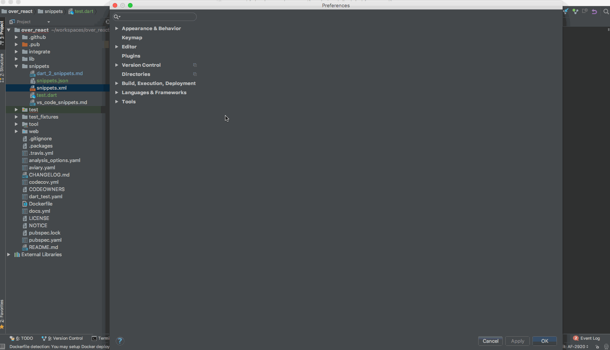
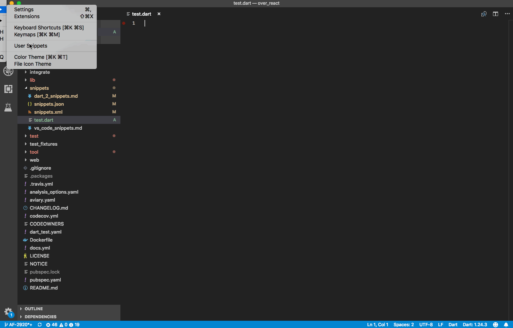

## Available Code Snippets

Below is a list of all available over_react snippets and their Triggers for Webstorm/IntelliJ and VS Code. 

| Trigger | Content |
| -------: | ------- |
| `orStless`  |  Stateless component skeleton with abbreviated props declaration |
| `orStful`  | Stateful component skeleton with abbreviated props and state declarations |
| `orStlessConnect`  |  Stateless component skeleton with the generated factory wrapped in `connect` |
| `orFunc`  | Function component skeleton with abbreviated props declaration |
| `orAdvStless`   | Stateless component skeleton with a props class alias|
| `orAdvStful`   | Stateful component skeleton with props and state class aliases|
| `orAdvFunc`   | Function component skeleton with props class alias|

## WebStorm and IntelliJ Snippets

### Installation Instructions

<br>

1. Copy the command below and run it in your terminal.

   ```bash
   curl https://raw.githubusercontent.com/Workiva/over_react/master/snippets/snippets.xml | pbcopy
   ```
   
2. Open preferences and select "Editor" > "Live Templates"
3. (Optional) Create a new "OverReact Snippets" group by clicking the "+" button in the<br> 
   upper right corner and selecting "Template Group..."
4. Right click on your new (or an existing) template group and select Paste.
5. Use any "prefix" or "trigger" from the table above in any ".dart" file to invoke a snippet
6. Press "tab" to move to and set the next variable.

## VS Code Snippets

### Installation Instructions

<br>

1. Copy the command below and run it in your terminal.

    ```bash
    curl https://raw.githubusercontent.com/Workiva/over_react/master/snippets/snippets.json | pbcopy
    ```

2. Click on "Code", select "Preferences" and select "User Snippets"
3. Select "New Global Snippet file..."
4. Name the file something meaningful like "OverReact Snippets"
5. Select all of the boiler plate in the snippet file just created and replace it by pasting the<br>
   VS Code snippets json copied after running the command in step 1
6. Use any "prefix" or "trigger" from the table above in any ".dart" file to invoke a snippet
7. Press "tab" to move to and set the next variable.
