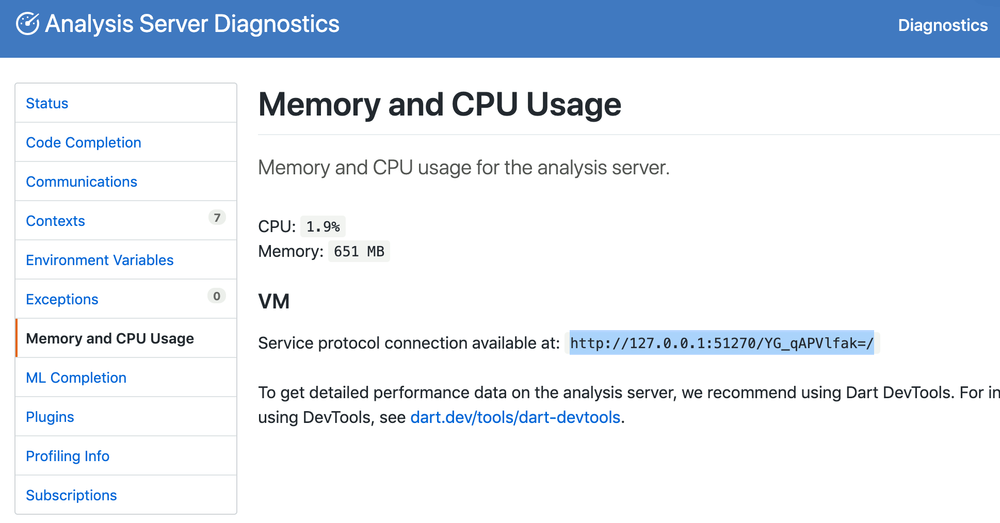
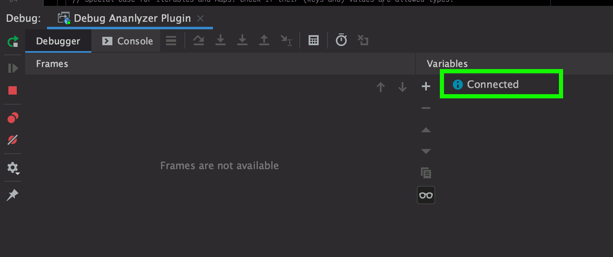

# OverReact Analyzer Plugin

> A [Dart analyzer plugin][analyzer_plugin] for OverReact


## Try it in your package!
1. Add over_react to your pubspec.yaml

    __If you wish to develop the plugin locally, see [this section](#local-development).__
    
1. Enable the plugin in your analysis_options.yaml:
    ```yaml
    analyzer:
      plugins:
        over_react
    ```
1. Restart the Dart Analysis Server in your IDE
   
## Repo Structure

See the [analyzer_plugin package structure documentation][analyzer_plugin_package_structure] for terminology and more info.

- _over_react_: the "host" package
- _over_react_analyzer_plugin_ (`over_react/tools/analyzer_plugin`) - the "boostrap" and "plugin" packages, merged
        
    We decided to merge these packages since it allows us to avoid creating a separate package for the plugin, which would have resulted in a more painful dev/release experience. (Since the plugin depends on over_react, we'd want to use monorepo to manage the packages. However, we can't do that currently, due to internal tooling restrictions that prevent us from having multiple packages declared in a single repository.)
        
- _playground_ - (`over_react/tools/analyzer_plugin/playground`) - a "target" package that consumes the plugin, useful for manually testing plugin during development 
        
## Local Development

See [analyzer_plugin's tutorial][analyzer_plugin_tutorial] on building a plugin for general information on developing a Dart analyzer plugin.

### Setup

**Before you do anything:** run 
```sh
dart tool/init_local_dev.dart
```

Normally, the Dart Analysis Server does a one-time copy of plugin code into the Dart Analysis Server state folder (usually `~/.dartServer/.plugin_manager`), and never updates for plugins derived from path dependencies (TODO make dart-lang issue for this). 

This means, normally, ___any changes you make to the plugin will not be reflected___.

This script sets up a symlink to point to the original plugin directory (replacing any copy if it exists), so that changes are always reflected.  

### Development cycle
1. Make changes to the plugin within the _over_react_analyzer_plugin_ directory
1. In the _playground_ directory or in [another package you've pulled the plugin into](#pulling-in-a-local-version-of-the-plugin), restart the Analysis Server
1. Wait for the Analysis Server to boot up, analyze, and run your updated plugin code    

### Debugging the Plugin
The dev experience when working on this plugin isn't ideal (See the `analyzer_plugin` debugging docs [for more information](https://github.com/dart-lang/sdk/blob/master/pkg/analyzer_plugin/doc/tutorial/debugging.md)), but it's possible debug and see logs from the plugin.

These instructions are currently for JetBrains IDEs (IntelliJ, WebStorm, etc.) only.

Before starting, ensure you have the option `Scope analysis to the current package` turned on Dart Analysis Server Settings. You can make the development cycle even faster by opening `analyzer_plugin` as it's own project (rather than opening `over_react`) in your IDE.

1. Ensure your Dart version is at least `2.8.3`. (The protocol connection was made available somewhere around this version)

1. In your project, create a new Run Configuration using the `Dart Remote Debug` template
    
     
    
     
    
1. Ensure the "Search sources in" section is pointing to the plugin package directory. Save your new Configuration. We'll come back to it later.
    
     

1. Open the "Registry" using the command palette (<kbd>Command</kbd>+<kbd>Shift</kbd>+<kbd>A</kbd>)

    
    
1. Find the `dart.server.vm.options` key and set the value to `--observe=0` (allows access to the Observatory on a random, non-allocated port)

     
            
1. Next, we need to open the analyzer diagnostics to find the URL for our debugger. Open the Dart Analaysis Server Settings, and click `View analyzer diagnostics`. This will open your browser.
     

1. In the Analysis Server Diagnostics page in your browser, click the `Memory and CPU Usage` tab. Copy the protocol connection URL.
    
  
1. Run your newly created configuration by selecting it and clicking the "Debug" button
    
    
    
1. Finally, when prompted, paste the URL you just copied and click `OK`.
    

1. In the debugger tab that was opened, verify that the debugger connected.
    
    
    
Congrats, you're debugging! 🎉

You can now set breakpoints, view logs, and do everything else you'd normally do in the debugger for.


[analyzer_plugin]: https://github.com/dart-lang/sdk/tree/master/pkg/analyzer_plugin
[analyzer_plugin_tutorial]: https://github.com/dart-lang/sdk/blob/master/pkg/analyzer_plugin/doc/tutorial/tutorial.md
[analyzer_plugin_package_structure]: https://github.com/dart-lang/sdk/blob/master/pkg/analyzer_plugin/doc/tutorial/package_structure.md
