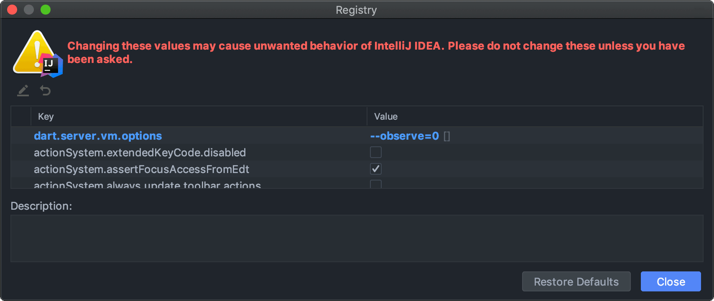

# OverReact Analyzer Plugin

[](https://workiva.github.io/over_react/analyzer_plugin/lints/)
[](https://workiva.github.io/over_react/analyzer_plugin/assists/)

> A [Dart analyzer plugin][analyzer_plugin] for OverReact.

---

* __[Try it in your Package](#try-it-in-your-package)__
* __[Repo Structure](#repo-structure)__
* __[Local Development](#local-development)__
    * [Setup](#setup)
    * [Development Cycle](#development-cycle)
    * [Design Principles & Coding Strategies](#design-principles--coding-strategies)
    * [Debugging](#debugging-the-plugin)
    * [Documenting Diagnostics and Assists](#documenting-diagnostics-and-assists)
* __[Feature Ideas & Inspiration](#feature-ideas--inspiration)__

## Try it in your package!
1. Add over_react to your pubspec.yaml

    __If you wish to develop the plugin locally, see [this section](#local-development).__
    
1. Enable the plugin in your analysis_options.yaml:
    ```yaml
    analyzer:
      plugins:
        over_react
    ```
1. Restart the Dart Analysis Server in your IDE
   
## Repo Structure

See the [analyzer_plugin package structure documentation][analyzer_plugin_package_structure] for terminology and more info.

- _over_react_: the "host" package
- _over_react_analyzer_plugin_ (`over_react/tools/analyzer_plugin`) - the "bootstrap" and "plugin" packages, merged
        
    We decided to merge these packages since it allows us to avoid creating a separate package for the plugin, which would have resulted in a more painful dev/release experience. (Since the plugin depends on over_react, we'd want to use monorepo to manage the packages. However, we can't do that currently, due to internal tooling restrictions that prevent us from having multiple packages declared in a single repository.)
        
- _playground_ - (`over_react/tools/analyzer_plugin/playground`) - a "target" package that consumes the plugin, useful for manually testing plugin during development 
        
## Local Development

See [analyzer_plugin's tutorial][analyzer_plugin_tutorial] on building a plugin for general information on developing a Dart analyzer plugin.

### Setup

**Before you do anything:** run 
```sh
dart tool/init_local_dev.dart
```

Normally, the Dart Analysis Server does a one-time copy of plugin code into the Dart Analysis Server state folder (usually `~/.dartServer/.plugin_manager`), and never updates for plugins derived from path dependencies (TODO make dart-lang issue for this). 

This means, normally, ___any changes you make to the plugin will not be reflected___.

This script sets up a symlink to point to the original plugin directory (replacing any copy if it exists), so that changes are always reflected.  

### Development cycle
1. Make changes to the plugin within the _over_react_analyzer_plugin_ directory
1. In the _playground_ directory or in another package you've pulled the plugin into, restart the Analysis Server
1. Wait for the Analysis Server to boot up, analyze, and run your updated plugin code    

### Design Principles & Coding Strategies

* __Abide by [diagnostic message best practices][analyzer_plugin_diagnostic_message_guide].__
* __Plugin code should be robust against invalid ASTs.__
    * As the user types, they produce invalid code, and the plugin shouldn't crash/break when this is the case.
    * Defensively null-check on AST members.
* __Code dealing with ASTs should make as few assumptions as possible.__
    * For example, code that used to assume a method declaration's parent was a class was likely broken with the introduction of extension methods.
    * Use of `tryCast()` and `ancestorOfType()` makes this a lot easier.
* __For hints/diagnostics, avoid producing false positives.__
    * Often, you may not have enough information to determine with full confidence whether code is problematic. The plugin should not emit diagnostics in this case to avoid creating excessive noise, causing the plugin to become less valuable or frustrating for users.
* __Keep performance in mind.__
    * Diagnostics will run on potentially every Dart file in the project, and can severely affect user experience if they're slow. This is one of the bigger reasons why the Dart team avoided exposing analyzer plugin APIs for a while.
* __Use prior art when possible instead of reinventing the wheel.__
    * The [`analysis_server`][analysis_server] package in the Dart SDK is where the majority of the built-in hints, errors, assists, quick fixes, etc. are implemented. We have the opportunity to reuse parts of their architecture, testing strategies, etc.
* __Avoid using `AstNode.toSource` and `AstNode.childEntities`__ since they are approximations of the source. 
    * If you need to get the source for a replacement, use `sourceFile.getText(node.offset, node.end)`.

### Debugging the Plugin
The dev experience when working on this plugin isn't ideal (See the `analyzer_plugin` debugging docs [for more information](https://github.com/dart-lang/sdk/blob/master/pkg/analyzer_plugin/doc/tutorial/debugging.md)), but it's possible debug and see logs from the plugin.

These instructions are currently for JetBrains IDEs (IntelliJ, WebStorm, etc.) only.

Before starting, ensure you have the `analyzer_plugin` open as its own project (rather than opening `over_react`) in your IDE.

1. Ensure your Dart version is at least `2.8.3`. (The protocol connection was made available somewhere around this version)

1. In your project, create a new Run Configuration using the `Dart Remote Debug` template
    
    
    
    
    
1. Ensure the "Search sources in" section is pointing to the plugin package directory. Save your new Configuration. We'll come back to it later.
    
    

1. Open the "Registry" using the command palette (<kbd>Command</kbd>+<kbd>Shift</kbd>+<kbd>A</kbd>)

    
    
1. Find the `dart.server.vm.options` key and set the value to `--observe=0` (allows access to the Observatory on a random, non-allocated port)

    
            
1. Next, we need to open the analyzer diagnostics to find the URL for our debugger. Open the Dart Analysis Server Settings, and click `View analyzer diagnostics`. This will open your browser.

    

1. In the Analysis Server Diagnostics page in your browser, click the `Memory and CPU Usage` tab. Copy the protocol connection URL.

    
  
1. Run your newly created configuration by selecting it and clicking the "Debug" button
    
    
    
1. Finally, when prompted, paste the URL you just copied and click `OK`.

    

1. In the debugger tab that was opened, verify that the debugger connected.
    
    
    
Congrats, you're debugging! 🎉

You can now set breakpoints, view logs, and do everything else you'd normally do in the debugger for.

### Documenting Diagnostics and Assists

__All diagnostics and assists should be documented!!!__

Documentation for the diagnostics ands assists provided by this analyzer plugin are published to <https://workiva.github.io/over_react/analyzer_plugin/>.

This is accomplished by placing a `@DocsMeta` annotation on a `DiagnosticCode` for diagnostics, and an `AssistKind` for assists. In order for them to work properly, the property the `DiagnosticCode` or `AssistKind` is assigned to __must be a `const`__ as shown in the examples below.

#### Examples

- Error Example: [StyleMissingUnitDiagnostic](lib/src/diagnostic/style_missing_unit.dart)
- Lint / Warning Example: [ForwardOnlyDomPropsToDomBuildersDiagnostic](lib/src/diagnostic/forward_only_dom_props_to_dom_builders.dart)

#### Best Practices
* The value of `DiagnosticCode.name` should always start with `over_react_`.
* The value of `DiagnosticCode.message`/`DiagnosticCode.correction`/ should abide by the [diagnostic message best practices][analyzer_plugin_diagnostic_message_guide] used by official Dart analyzer diagnostics. [Examples of official diagnostics messages.][analyzer_plugin_diagnostic_message_examples]

    Additionally:
     
    * The value of `DiagnosticCode.message` should not include the steps that users should take to correct the diagnostic. 
        * Use `DiagnosticCode.correction` for this as shown in the [examples](#examples) above.
        
* The value of `DocsMeta.description` should use consistent terminology based on the severity of the diagnostic.
    * `AnalysisErrorSeverity.INFO`s and `AnalysisErrorSeverity.WARNING`s should start with _"Avoid"_ or _"Prefer"_.
    * `AnalysisErrorSeverity.ERROR`s should start with _"Do not"_, _"Never"_ or _"Always"_.
    
    Check out the [examples](#examples) above for demonstrations of this.

* The value of `FixKind.message` and `AssistKind.message` should NOT end with a period.
* When possible, the value of `DocsMeta.description` _(first argument passed to the `@DocsMeta` annotation)_ should match the value of `DiagnosticCode.message`.
    * Sometimes this isn't possible as a result of using `errorMessageArgs` to pass dynamic information into the message.
* The value of `DocsMeta.details` gets parsed as markdown, and should provide as much detail about the diagnostic as possible - including a "GOOD" and "BAD" example when possible _(as shown in the [examples](#examples) above)_.

#### Updating Published Documentation
1. When a new/updated diagnostic or assist merges to master, merge master into the `gh-pages` branch _(it should merge cleanly)_.
1. From the `tools/analyzer_plugin/` directory, run:
    ```shell script
    dart ./tool/doc.dart --gh-pages
    ```
1. Commit the changes, and push them to the `gh-pages` branch.
    This will deploy the updated documentation to <https://workiva.github.io/over_react/analyzer_plugin/> - typically within a matter of seconds. 

## Feature Ideas & Inspiration

We drew inspiration from the following:
* Flutter analysis functionality (actually built into the Dart SDK via [analysis_server][analysis_server]).
* React JS IDE plugins
    * [ESLint Plugin](https://github.com/yannickcr/eslint-plugin-react)
    * [ReactEd](https://marketplace.visualstudio.com/items?itemName=ReactEd.reacted)
* [AngularDart analyzer plugin](https://github.com/dart-lang/angular/tree/master/angular_analyzer_plugin)


[analyzer_plugin]: https://github.com/dart-lang/sdk/tree/master/pkg/analyzer_plugin
[analyzer_plugin_tutorial]: https://github.com/dart-lang/sdk/blob/master/pkg/analyzer_plugin/doc/tutorial/tutorial.md
[analyzer_plugin_package_structure]: https://github.com/dart-lang/sdk/blob/master/pkg/analyzer_plugin/doc/tutorial/package_structure.md
[analyzer_plugin_diagnostic_message_guide]: https://github.com/dart-lang/sdk/blob/5bac4d9b0cdc12a21d0b9914a3c8c0d9716aa705/pkg/front_end/lib/src/fasta/diagnostics.md#guide-for-writing-diagnostics
[analyzer_plugin_diagnostic_message_examples]: https://github.com/dart-lang/sdk/blob/5bac4d9b0cdc12a21d0b9914a3c8c0d9716aa705/pkg/front_end/messages.yaml
[analysis_server]: https://github.com/dart-lang/sdk/tree/master/pkg/analysis_server
