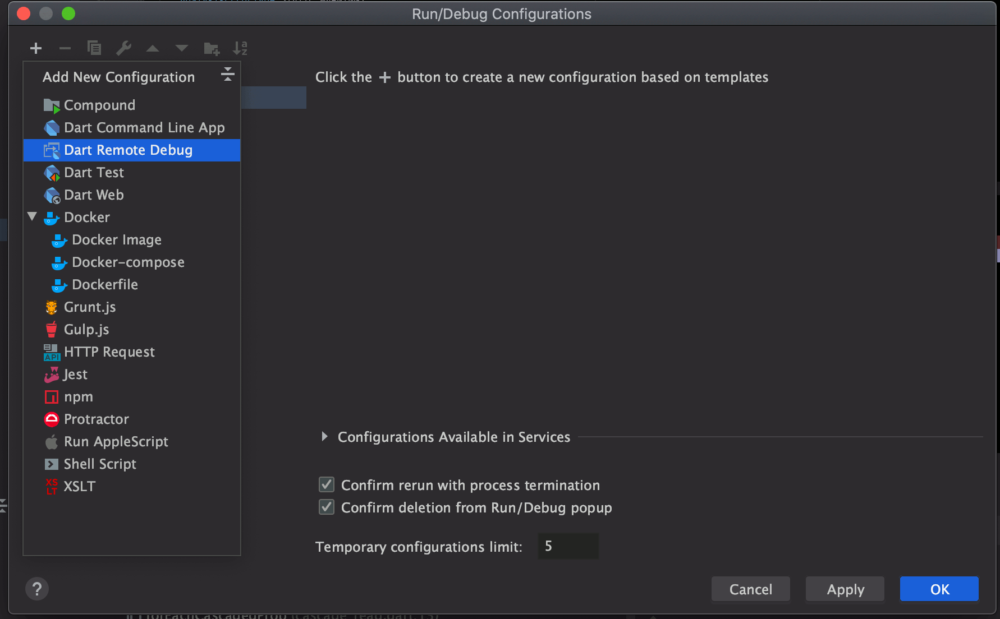

# OverReact Analyzer Plugin

> A [Dart analyzer plugin][analyzer_plugin] for OverReact.

---

* __[Goal](#goal)__
* __[Try it in your Package](#try-it-in-your-package)__
* __[Repo Structure](#repo-structure)__
* __[Local Development](#local-development)__
    * [Setup](#setup)
    * [Development Cycle](#development-cycle)
    * [Design Principles & Coding Strategies](#design-principles--coding-strategies)
    * [Debugging](#debugging-the-plugin)
* __[Feature Ideas & Inspiration](#feature-ideas--inspiration)__
* __[Limitations](#limitations)__

## Goal

We want to improve the developer experience for Workiva developers writing React in Dart (and bring it closer to the React JS dev experience).

This plugin has the potential to help achieve that goal by:
* Providing static analysis of common pitfalls, with useful error messages and automatic fix suggestions.
* Making the fluent interface syntax easier to write and deal with.
* Helping automate common changes that can't be achieved with snippets alone (AKA "assists").
* Encouraging best practices via lints.
* (Potentially) Making it easier to navigate component nesting and the flow of props.

## Try it in your package!
1. Add over_react to your pubspec.yaml

    __If you wish to develop the plugin locally, see [this section](#local-development).__
    
1. Enable the plugin in your analysis_options.yaml:
    ```yaml
    analyzer:
      plugins:
        over_react
    ```
1. Restart the Dart Analysis Server in your IDE
   
## Repo Structure

See the [analyzer_plugin package structure documentation][analyzer_plugin_package_structure] for terminology and more info.

- _over_react_: the "host" package
- _over_react_analyzer_plugin_ (`over_react/tools/analyzer_plugin`) - the "boostrap" and "plugin" packages, merged
        
    We decided to merge these packages since it allows us to avoid creating a separate package for the plugin, which would have resulted in a more painful dev/release experience. (Since the plugin depends on over_react, we'd want to use monorepo to manage the packages. However, we can't do that currently, due to internal tooling restrictions that prevent us from having multiple packages declared in a single repository.)
        
- _playground_ - (`over_react/tools/analyzer_plugin/playground`) - a "target" package that consumes the plugin, useful for manually testing plugin during development 
        
## Local Development

See [analyzer_plugin's tutorial][analyzer_plugin_tutorial] on building a plugin for general information on developing a Dart analyzer plugin.

### Setup

**Before you do anything:** run 
```sh
dart tool/init_local_dev.dart
```

Normally, the Dart Analysis Server does a one-time copy of plugin code into the Dart Analysis Server state folder (usually `~/.dartServer/.plugin_manager`), and never updates for plugins derived from path dependencies (TODO make dart-lang issue for this). 

This means, normally, ___any changes you make to the plugin will not be reflected___.

This script sets up a symlink to point to the original plugin directory (replacing any copy if it exists), so that changes are always reflected.  

### Development cycle
1. Make changes to the plugin within the _over_react_analyzer_plugin_ directory
1. In the _playground_ directory or in [another package you've pulled the plugin into](#pulling-in-a-local-version-of-the-plugin), restart the Analysis Server
1. Wait for the Analysis Server to boot up, analyze, and run your updated plugin code    

### Design Principles & Coding Strategies

* __Abide by [diagnostic message best practices][analyzer_plugin_diagnostic_message_guide].__
* __Plugin code should be robust against invalid ASTs.__
    * As the user types, they produce invalid code, and the plugin shouldn't crash/break when this is the case.
    * Defensively null-check on AST members.
* __Code dealing with ASTs should make as few assumptions as possible.__
    * For example, code that used to assume a method declaration's parent was a class was likely broken with the introduction of extension methods.
    * Use of `tryCast()` and `ancestorOfType()` makes this a lot easier.
* __For hints/diagnostics, avoid producing false positives.__
    * Often, you may not have enough information to determine with full confidence whether code is problematic. The plugin should not emit diagnostics in this case to avoid creating excessive noise, causing the plugin to become less valuable or frustrating for users.
* __Keep performance in mind.__
    * Diagnostics will run on potentially every Dart file in the project, and can severely affect user experience if they're slow. This is one of the bigger reasons why the Dart team avoided exposing analyzer plugin APIs for a while.
* __Use prior art when possible instead of reinventing the wheel.__
    * The [`analysis_server`][analysis_server] package in the Dart SDK is where the majority of the built-in hints, errors, assists, quick fixes, etc. are implemented. We have the opportunity to reuse parts of their architecture, testing strategies, etc.
* __Avoid using `AstNode.toSource` and `AstNode.childEntities`__ since they are approximations of the source. 
    * If you need to get the source for a replacement, use `sourceFile.getText(node.offset, node.end)`.

### Debugging the Plugin
The dev experience when working on this plugin isn't ideal (See the `analyzer_plugin` debugging docs [for more information](https://github.com/dart-lang/sdk/blob/master/pkg/analyzer_plugin/doc/tutorial/debugging.md)), but it's possible debug and see logs from the plugin.

These instructions are currently for JetBrains IDEs (IntelliJ, WebStorm, etc.) only.

Before starting, ensure you have the option `Scope analysis to the current package` turned on Dart Analysis Server Settings. You can make the development cycle even faster by opening `analyzer_plugin` as it's own project (rather than opening `over_react`) in your IDE.

1. Ensure your Dart version is at least `2.8.3`. (The protocol connection was made available somewhere around this version)

1. In your project, create a new Run Configuration using the `Dart Remote Debug` template
    
     
    
     
    
1. Ensure the "Search sources in" section is pointing to the plugin package directory. Save your new Configuration. We'll come back to it later.
    
     

1. Open the "Registry" using the command palette (<kbd>Command</kbd>+<kbd>Shift</kbd>+<kbd>A</kbd>)

    
    
1. Find the `dart.server.vm.options` key and set the value to `--observe=0` (allows access to the Observatory on a random, non-allocated port)

     
            
1. Next, we need to open the analyzer diagnostics to find the URL for our debugger. Open the Dart Analaysis Server Settings, and click `View analyzer diagnostics`. This will open your browser.
     

1. In the Analysis Server Diagnostics page in your browser, click the `Memory and CPU Usage` tab. Copy the protocol connection URL.
    
  
1. Run your newly created configuration by selecting it and clicking the "Debug" button
    
    
    
1. Finally, when prompted, paste the URL you just copied and click `OK`.
    

1. In the debugger tab that was opened, verify that the debugger connected.
    
    
    
Congrats, you're debugging! 🎉

You can now set breakpoints, view logs, and do everything else you'd normally do in the debugger for.

## Feature Ideas & Inspiration

We drew inspiration from the following:
* Flutter analysis functionality (actually built into the Dart SDK via [analysis_server][analysis_server]).
* React JS IDE plugins
    * [ESLint Plugin](https://github.com/yannickcr/eslint-plugin-react)
    * [ReactEd](https://marketplace.visualstudio.com/items?itemName=ReactEd.reacted)
* [AngularDart analyzer plugin](https://github.com/dart-lang/angular/tree/master/angular_analyzer_plugin)

#### Abandoned Feature Ideas

* Outline for similar behavior to closing tags.
    * Outline implementation is barely supported in analyzer plugin.
    * Need to suggest closing tags API for plugin, maybe this would be a good entry point.
* Breadcrumbs: part of the IDE plugin, not the analyzer plugin.
    * Greg has most of a JetBrains plugin done.
* [Prop drilling](https://marketplace.visualstudio.com/items?itemName=ReactEd.reacted#prop-drilling): isn't supported by the plugin.

## Limitations

### Dart `analyzer_plugin` Limitations

* Not advertised for public use (but [public use isn't discouraged](https://github.com/dart-lang/sdk/issues/35516)).
* API is pretty rough in some spots.
* Outline can't be empty, seems to only work intermittently work (at least in IntelliJ).
* Assist/Fix Mixin APIs not async, preventing usage of edit builders (which are recommended); we have our own local copies of these that fix this, and should probably be contributed back at some point.
* Some features might not be supported by all IDEs.
* Workflow involves restarting the analysis server every time you make a change.
* At times, lints do not resolve in the IDE unless you restart the analysis server.

### Analyzer Limitations

* Can easily go from AST to Elements but not the other way around (`computeNode` is deprecated). Most of the time should not be problematic since if you have access to an Element, you usually have access to the corresponding AST.
    * Might be able to work around this using `NodeLocator`.
* `toSource` should be used with caution since it's an approximation of the source.


[analyzer_plugin]: https://github.com/dart-lang/sdk/tree/master/pkg/analyzer_plugin
[analyzer_plugin_tutorial]: https://github.com/dart-lang/sdk/blob/master/pkg/analyzer_plugin/doc/tutorial/tutorial.md
[analyzer_plugin_package_structure]: https://github.com/dart-lang/sdk/blob/master/pkg/analyzer_plugin/doc/tutorial/package_structure.md
[analyzer_plugin_diagnostic_message_guide]: https://github.com/dart-lang/sdk/blob/5bac4d9b0cdc12a21d0b9914a3c8c0d9716aa705/pkg/front_end/lib/src/fasta/diagnostics.md#guide-for-writing-diagnostics
[analysis_server]: https://github.com/dart-lang/sdk/tree/master/pkg/analysis_server
